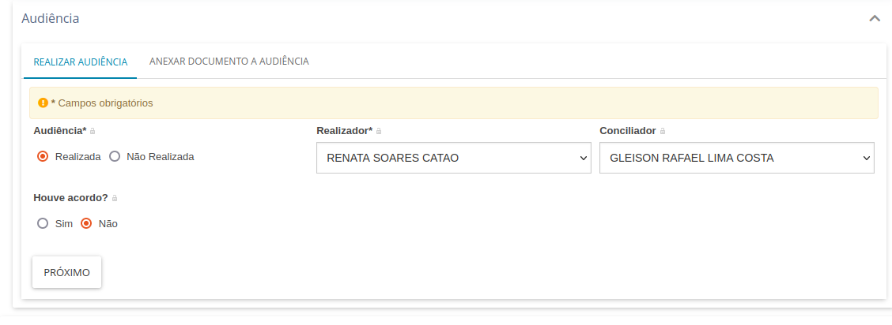
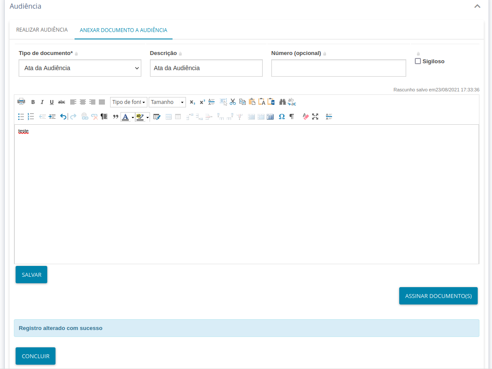
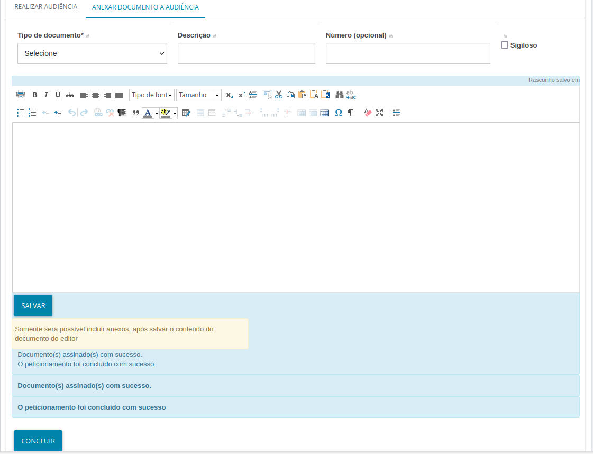
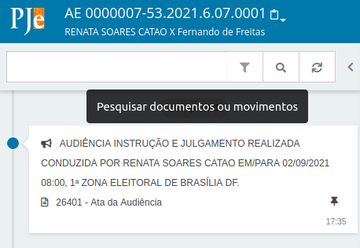

# Instruções sobre audiências

## Novo procedimento (a partir de 04/09/2021)

### Quero marcar uma audiência (novo procedimento):

Pelo "Analisar Novo Processo - ZE", "Analisar Determinação - ZE" / "Analisar Processo - ZE" (e nas respectivas tarefas com processos urgentes), selecione "Audiências"

Estando na tarefa "Audiências", pelo "Cancelar", você retornará à tarefa anterior. As opções da tela atual estão descritas [na wiki do PJe](http://www.pje.jus.br/wiki/index.php/Funcionalidades#Tarefas_de_audi.C3.AAncia).

Para marcar uma nova audiência, deve-se ir até o final da tela, no agrupador "Audiência". 

Serão exibidas as opções de designação sugerida e designação manual. Selecione designação sugerida, o tipo de audiência e selecione "Procurar horário". O sistema exibirá o próximo horário disponível. Ao clicar em "Reservar sala", o sistema agendará a audiência gerando a movimentação de designação nos autos. 

Se já houver audiência marcada anteriormente não realizada, o usuário deve selecionar o opção "Designar nova audiência" e prosseguir com a marcação.

** Configurações necessárias para o correto funcionamento:

- Configurar salas pra cada órgão julgador

- Configurar tempo de audiência para cada tipo de audiência e cada órgão julgador

Se já houver audiência marcada anteriormente não realizada, o usuário só conseguirá agendar novas se a variável de fluxo correta estiver setada na tarefa. A expressão a ser utilizada é a seguinte:

 #{tramitacaoProcessualService.gravaVariavelTarefa('pje:fluxo:audiencia:permitirDesignarMultiplas', true)}

Deve ser configurada essa expressão em uma ação do evento entrar no nó.

### Opções para audiências já designadas (novo procedimento)

Após agendada, as audiências marcadas aparecerão no agrupador "Últimas audiências do processo". Na coluna "Ações" da tabela de audiências desse agrupador estarão disponíveis as seguintes opções:

- Realização
- Redesignar
- Cancelamento
- Converter em Diligência

### Quero realizar uma audiência já marcada (novo procedimento):

Cada audiência agendada terá a lista de opções descrita acima. O usuário deverá clicar "Realização" para a audiência desejada.

O sistema apresentará no final da tela um quadro denominado "REALIZAR AUDIÊNCIA" para registrar as informações.

O usuário poderá informar se a audiência foi realizada e, em caso afirmativo, os nomes do realizador e do conciliador (podem ser iguais), assim como dados do acordo. O usuário clica em "Próximo", e a audiência ficará marcada como finalizada.

A aba "Anexar documento a audiência" passa a ser apresentada. O usuário preenche o documento da ata pelo editor de texto disponível na aba.

O usuário seleciona "Salvar" e o botão "Assinar documento(s)" será disponibilizado.

Ao assinar o documento, o usuário deve selecionar o botão "Concluir". 

Antes mesmo de acionar o botão, o documento da ata já será apresentado nos autos digitais.

Após clicar no botão "Concluir", o sistema atualização a tela e exibe o status da audiência em questão como "Realizada", não apresentando mais a lista de ações. 

O movimento de realização juntamente com o documento assinado serão exibidos nos autos.  

** Configurações

- Parâmetro "pje:audiencia:realizacaoEmFluxo" esteja marcado como "false".

- Conciliadores vinculados a localização da zona aparecerão na lista de conciliadores

- Magistrados configurados no órgão julgador aparecerão na lista de realizadores

### "Finalizei a audiência, mas não houve movimento de realização" (novo procedimento)

O movimento de realização será lançado após o botão "Concluir" ser acionado. Caso o botão não seja acionado, o documento eventualmente produzido aparece nos autos, mas sem movimento associado. Nesse caso, na tarefa "Audiências" será apresentada a opção "Ata de audiência".

A opção exibirá, no final da tela, os dados da realização e permitirá ao usuário clicar em "Proximo". 

A tela para construção do documento será exibida, mas o usuário deve clicar em "Concluir". O movimento será lançado nos autos vinculado ao documento já gerado.

### "Finalizei a audiência, mas não fiz a ata" (novo procedimento)

O documento da audiência será produzido quando a aba "Anexar documento a audiência". Caso o usuário não finalize a ata, mas já tiver informado os dados de realização, na tarefa "Audiências" será apresentada a opção "Ata de audiência". 

A opção exibirá, no final da tela, os dados da realização e permitirá ao usuário clicar em "Proximo" para construir o documento. 

Para finalizar, após assinatura, o usuário deve clicar em "Concluir".

### Quero verificar informações sobre todas as audiências do processo

Para verificar audiências do processo e seu estado atual, o usuário deverá abrir os autos digitais e, no menu de opções (ícone de três barrinhas horizontais no canto superior direito dos autos) selecionar a opção "Audiência". 

O sistema apresentará uma listagem com as audiências já marcadas com os respectivos estados atuais.

### Movimento lançado de audiência

O movimento lançado quando há designação ou realização da audiência é o mesmo, de código 970. O que muda é o complemento. O movimento segue o seguinte formato:

Audiência #{tipo_de_audiencia}  #{situacao_da_audiencia} conduzida por #{dirigida_por} em/para #{data_hora},  #{local}

onde:

tipo_de_audiencia - preenchido com o tipo de audiência respectivo. Exemplo: Conciliação 
situacao_da_audiencia - preenchido com a etapada da audiência. Exemplo: designada
dirigida_por - preenchido com o realizador da audiência. Exemplo: nome do magistrado titular do órgão julgador
data_hora - data da audiência. Se uma audiência é agendada no dia 23/08/2021 para ocorrer no dia 08/09/2021, às 13:30, o movimento informará "08/09/2021 13:30"
local - nome do órgão julgador da audiência. Exemplo: 001ª ZONA ELEITORAL DE RIO BRANCO AC

No caso da designação, o PJe atribuirá Juiz(a), de acordo com tabela do SGT.

No caso da realização, o PJe preenche o realizador com o valor Juiz(a) ou Conciliador(a), conforme perfil que o realizador tiver no sistema.

## Procedimento antigo no primeiro grau (até 03/09/2021)

### Quero marcar uma audiência (procedimento antigo):

Pelo "Analisar Novo Processo - ZE", "Analisar Determinação - ZE" / "Analisar Processo - ZE", selecione "Gerenciar Audiência"

Estando na tarefa "Gerenciar Audiência - ZE", você terá as opções: "Designar Audiência", "Verificar existência de audiência" e "Cancelar". Pelo "Cancelar", você retornará à tarefa anterior. Pelo "Designar Audiência", você poderá agendar audiência ou realizar audiências já agendadas.

A tela será exibida com algumas opções, conforme descrito [na wiki do PJe](http://www.pje.jus.br/wiki/index.php/Funcionalidades#Tarefas_de_audi.C3.AAncia).

Deve-se ir até o final da tela, no agrupador "Audiência".

Vc poderá agendar uma nova audiência apertando em "Reservar sala".

 Ao clicar em "Reservar sala", o sistema agendará a audiência gerando a movimentação de designação nos autos. 
 

** Configurações necessárias para o correto funcionamento:

- Configurar salas pra cada órgão julgador

- Configurar tempo de audiência para cada tipo de audiência e cada órgão julgador

Se já houver audiência marcada anteriormente não realizada, o usuário só conseguirá agendar novas se a variável de fluxo correta estiver setada na tarefa. A expressão a ser utilizada é a seguinte:

 #{tramitacaoProcessualService.gravaVariavelTarefa('pje:fluxo:audiencia:permitirDesignarMultiplas', true)}

Deve ser configurada essa expressão em uma ação do evento entrar no nó.

### Opções para audiências já designadas (procedimento antigo)

Após agendada, as audiências marcadas aparecerão no agrupador "Últimas audiências do processo". 

Na coluna "Ações" da tabela de audiências desse agrupador estarão disponíveis as seguintes opções:

- Redesignar
- Cancelamento
- Converter em Diligência

Pela tarefa atual, o usuário tem a opção de "Retornar ao Gerenciar Audiência".

** Configurações necessária para o correto funcionamento

Parâmetro "pje:audiencia:realizacaoEmFluxo" esteja marcado como "true"

### Quero realizar uma audiência já marcada (procedimento antigo):

A partir da tarefa "Gerenciar Audiência - ZE", o usuário deve selecionar "Verificar existência de audiência". Se houver audiência pendente de realização, o sistema encaminhará o usuário para a tarefa "Informar Dados da Audiência - ZE". A tarefa permitirá que o usuário registre a realização da primeira audiência pendente de realização. O usuário poderá informar se a audiência foi realizada e, em caso afirmativo, os nomes do realizador e conciliador, assim como dados do acordo.

Nota: quando o usuário aperta em "Verificar existência de audiência", o sistema verifica se existe audiência agendada para hoje ou para dias seguintes. Se tiver, ele encaminha para a tarefa de fazer o registro da audiência. Caso contrário, ele retorna para o Gerenciar audiências. 

Ao finalizar, a audiência ficará marcada como finalizada. As seguintes opções estarão disponíveis: "Minutar ata de audiência" e "Retornar ao Gerenciar Audiência". O usuário deverá selecionar a opção "Minutar ata de audiência". O sistema apresentará a tela com o editor de texto para a produção da ata. A ata poderá ser construída e assinada nessa mesma tarefa, o que fará com que a movimentação de realização seja gerada, juntamente com a ata. O usuário também poderá selecionar a opção "Remeter para o Juiz Eleitoral assinar". Após a assinatura do juiz, o movimento e o documento assinado serão exibidos nos autos. 

** Configurações necessária para o correto funcionamento

Parâmetro "pje:audiencia:realizacaoEmFluxo" esteja marcado como "true"

