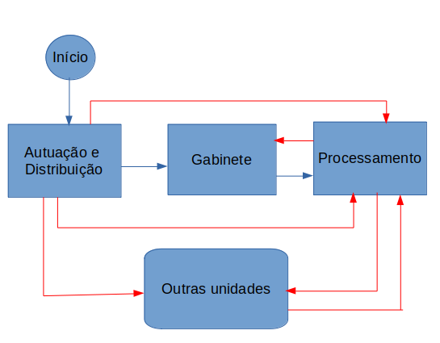

# Tramitação processual

Um processo judicial se inicia no PJe da Justiça Eleitoral quando um [usuário externo](http://www.pje.jus.br/wiki/index.php/Regras_de_neg%C3%B3cio#RN277), que pode ser advogado, Ministério Público, Autoridade Policial ou qualquer jurisdicionado, cadastra o processo incluindo os dados e a petição inicial apresentando seu pleito. O processo pode também ser iniciado por um servidor da Justiça Eleitoral com características de [usuário interno](http://www.pje.jus.br/wiki/index.php/Regras_de_neg%C3%B3cio#RN394). Ao finalizar o que denomina-se como protocolo do processo, ocorre a [distribuição automática](http://www.pje.jus.br/wiki/index.php/Distribui%C3%A7%C3%A3o), ou seja, o processo tem o relator designado de acordo com competências e utilizando um mecanismo de sorteio.

Ao ser iniciado, o processo judicial, via de regra, passa por três unidades principais dentro do tribunal: Autuação e Distribuição, Gabinete e Processamento.

Na Autuação e Distribuição, é realizada uma [triagem](corregedoria.md#verificar-e-certificar-dados-do-processo), onde um servidor verifica os dados do processo e encaminha o pleito para análise do relator, ou seja, do Gabinete. No Gabinete, o processo é analisado e são expedidos os atos judiciais. O processo é então encaminhado para a Unidade de processamento, onde são realizados os devidos cumprimentos. 

Por vezes, outras unidades precisam se manifestar no processo. O encaminhamento do processo para essas unidades é feito, em geral, pelo Processamento, de acordo com determinações do Gabinete. A autuação pode, em alguns momentos, remeter o processo diretamente para outras unidades. 

# Procedimentos da corregedoria

Aqui vamos registrar as possibilidades de atuação em processos por meio de tarefas de fluxo quando eles estão nas unidades da corregedoria. 

## Verificar e Certificar dados do processo

Um processo de uma classe não corregedoria entra no PJe por meio do Fluxo Originárias na tarefa Verificar e Certificar dados do processo. Essa tarefa é de responsabilidade da Unidade de Autuação e Distribuição.

O processo, seguindo o fluxo padrão, cairá na tarefa [Remeter Processo](corregedoria.md#remeter-processo)

## Remeter Processo

A partir dessa tarefa, há a possibilidade de iniciar o cumprimento na corregedoria por meio da transição [Remeter à Unidade de Fiscalização e Cadastro Corregedoria](corregedoria.md#remeter-a-unidade-de-fiscalizacao-e-cadastro-corregedoria)

### Remeter à Unidade de Fiscalização e Cadastro Corregedoria

Aqui o processo irá para o [fluxo principal de corregedoria](corregedoria.md#fluxo-principal-corregedoria). Com essa transição, o fluxo originárias será encerrado e o único fluxo do processo será o da corregedoria.

## Verificar Pendências

A partir da tarefa Verificar Pendências, também há a possibilidade de se acionar a corregedoria. As possibilidades são: [Remeter à Unidade de Assuntos Judiciários - Corregedoria](corregedoria.md#remeter-a-unidade-de-assuntos-judiciarios-corregedoria), [Remeter ao Gabinete do Corregedor](corregedoria.md#remeter-ao-gabinete-do-corregedor) e [Remeter à Unidade de Fiscalização e Cadastro Corregedoria](corregedoria.md#remeter-a-unidade-de-fiscalizacao-e-cadastro-corregedoria)

### Remeter à Unidade de Assuntos Judiciários - Corregedoria

Lança movimento 60044 e remete o processo para o fluxo [Fluxo - Processar Atividades no Processo - Corregedoria](corregedoria.md#processar-atividades-no-processo-corregedoria)

Ao retornar, dependendo do que houve na execução. o caminho vai ser diferente. Se houve determinação para envio para o gabinete, o processo vai para [gab corregedoria]. Se não houve, o sistema verifica se houve determinação para arquivamento e envia para [realiza baixa]. Se não houve determinação para arquivamento, testa encaminhar SJD e volta pro verificar pendências ou então vai pro término. 

### Remeter ao Gabinete do Corregedor

Faz com que o [fluxo de gabinetes] seja iniciado no gabinete da corregedoria, sem redistribuir o processo

## Fluxo principal corregedoria

Estabelece o campo pessoa relator

Corregedoria Unidade de Fiscalização e Cadastro	Chefe de Seção
Corregedoria Unidade de Fiscalização e Cadastro	Servidor
Corregedoria Unidade de Fiscalização e Cadastro	Colaborador
Corregedoria Unidade de Fiscalização e Cadastro	Coordenador
Administração PJe	Administrador

### Verificar dados - Processo Corregedoria

Remeter à SJD - encerra fluxo da corregedoria e inicia fluxo originárias, lançando movimento (60005)

Remeter ao cumprimento de determinações - inicia fluxo de cumprimento determinações corregedoria. Finalizado, retorna ao verificar pendências - processo corregedoria

Elaborar decisão colegiada - inicia fluxo de decisão colegiada

Elaborar Decisão Monocrática - inicia fluxo de preparação de ato judicial

Remeter ao Certificar e alterar dados

### Verificar pendências - Processo Corregedoria

Remeter ao TSE desde que a aplicação seja de segundo grau

Devolver Processo Corregedoria a Origem

Arquivar processo - lança movimento e envia processo para  Manter Processos Arquivados - Processo Corregedoria
