[TOC]

## Cache do navegador

Cache do browser ou cache do navegador é a memória local do seu computador.

Dados em cache são informações como imagens, scripts  e  outras partes de sites visitados, salvas temporariamente em  navegadores de Internet como Chrome, Firefox ou Safari. Eles tornam a navegação mais rápida  já que recursos como  fotos e  documentos ficam salvos no computador do usuário. Muitas funcionalidades do PJe são executadas na própria máquina do usuário, onde ficam  guardados registros na memória da própria estação.  Por conta disso, às  vezes  pode ser necessário limpar o cache, seja para  liberar espaço 
em disco, para que alguns sites recarreguem o conteúdo ou quando você faz alguma atualização.

## Como limpar memória local do navegador (cache do browser)

Acesse, no navegador, o ícone que fica no canto superior direito que contém três tracinhos horizontais:

1.	Selecione Configurações; 

2.	Selecione o painel Privacidade e Segurança; 

3.	Na seção "Histórico", clique em "Limpar histórico"; 

4.	Acione o botão e selecione a opção "tudo" com a marcação "cache",  e,  em seguida, confirme a limpeza; 

5.	Atualize a página do PJe. 

Segue link sobre a limpeza do histórico: (https://support.mozilla.org/pt-BR/kb/como-limpar-cache-firefox)
 

## Esqueci minha senha e senha bloqueada

Sempre recebemos muitos e-mails ou chamados são abertos para resolver problemas de usuários que não conseguem cadastrar uma nova senha. 

Normalmente,  o  servidor  gera uma  nova senha  para o usuário, que recebe um  link para cadastrar uma nova senha em  seu e-mail. Ao acessar esse link, o usuário finaliza o cadastro, mas, às vezes, o  sistema  sinaliza  que  a  senha  está bloqueada. Nesses casos, o desbloqueio só ocorre se for utilizada a opção esqueci minha senha pelo próprio usuário. 

Ao passar essa orientação para o usuário, este nem sempre consegue resolver e termina clicando mais de uma vez na opção esqueci minha senha e se atrapalha com vários e-mails enviados com links de geração de senha e o problema não se resolve. 

Recomendamos, então, ao servidor, o seguinte:

1) Ir ao cadastro da pessoa física, trocar o e-mail do usuário e colocar o seu próprio e-mail;

2) Em seguida, ir à tela inicial do PJe e clicar no link "esqueci minha senha". Na Tela aberta, digitar o CPF do usuário e o seu e-mail;

3) Acessar novamente seu e-mail para abrir o link de redefinição de senha. Você conseguirá cadastrar uma nova senha e desbloquear o cadastro do usuário;

4) Por fim,  acesse  novamente  o cadastro do usuário e substitua o seu e-mail pelo e-mail original da pessoa e clique no botão para gerar novo link de cadastro de senha para que ela possa gerar uma nova senha.

## Documentos não lidos 

Controle que visa sinalizar ao servidor que documentos novos foram incluídos pelo usuário externo.

Esse  controle  é  só um aviso, e para  que o aviso não seja mais exibido, basta o usuário sinalizar que já viu o documento, não significando que ele efetivamente foi visto. Pode-se  marcar  que  o documento foi lido sem sequer ter aberto o documento. A marcação significa que o usuário quer que o aviso desapareça. Se o usuário abrir o documento, mas não marcar que já viu, o sistema vai continuar exibindo que há documentos não lidos. 

Mais informações sobre o comportamento da opção: (http://www.pje.jus.br/wiki/index.php/Funcionalidades#Processos_com_documentos_n.C3.A3o_lidos) 

## Atuação de Juiz Eleitoral Substituto na Zona Eleitoral e sigilo dos processos

Quando  um  juiz  eleitoral  se  declara suspeito, novo  juiz  é designado para o processo. Para que  o juiz eleitoral substituto visualize apenas o processo para o qual foi designado, sem ter acesso  a  todos os outros processos da Zona Eleitoral, inclusive aos sigilosos, deve-se, na configuração do PJe,  em órgão julgador, na aba visibilidade, configurar a visibilidade apenas para o cargo dele (juiz substituto) e, caso o processo seja sigiloso, adicioná-lo como visualizador do processo. 

Esse  procedimento  é  necessário  porque  na  justiça eleitoral   determinou-se,  por   definição negocial, que apenas o  juiz titular receba distribuição. Assim, quando um juiz titular se considera suspeito para julgar determinado processo, a menos que o processo seja redistribuído  a outro órgão julgador, não é possível impedir a visualização do juiz titular que se declarou suspeito, nem mesmo quando esse processo é sigiloso. 

## Publicar em sessão de julgamento 

Em sessão podemos publicar acórdão ou certidão de julgamento. 

No papel de assessor de plenário, deve-se ir ao menu "Audiência e Sessões" - "Publicação de decisões em sessão". 

Ao entrar  na  tela, deve-se selecionar uma data de sessão e mandar pesquisar. As sessões que tiverem acórdão ou certidão de julgamento  associados,  retornarão na pesquisa. 

Depois,  deve-se  preencher, na linha do(s) processo(s) correspondente que se quer publicar, as opções da publicação: data, tipo do prazo,  prazo. Se houver dois documentos, ou  seja, o acórdão e  a certidão, na coluna Documento deve-se marcar qual se quer publicar. Geralmente a certidão já vem marcada. Os processos que serão   publicados  devem estar selecionados por meio da caixa de seleção da primeira coluna. 

Os  documentos  só aparecerão se estiverem devidamente vinculados à sessão e se estiverem assinados. Depois de tudo pronto,  deve-se selecionar o  botão  salvar  e  depois o publicar.  

Por  meio dessa  mesma tela, o usuário pode publicar em sessão decisões monocráticas. O procedimento é o mesmo, mas para que as decisões apareçam na consulta, o gabinete tem que usar uma tarefa específica sinalizando que a decisão monocrática deve ser  publicada. 

Depois de tudo finalizado, o PJe gera uma intimação para as partes envolvidas de acordo com o que foi preenchido, com os parâmetros configurados, ou seja:  

- pje:intimarEmSessaoColegiada:fiscalDaLei - Notifica que o fiscal da lei será intimado nas publicações em sessão de decisões colegiadas
	
- pje:intimarEmSessaoMonocratica:fiscalDaLei - Notifica que o fiscal da lei será intimado nas publicações em sessão de decisões monocrátivas

O Ministério Público, como fiscal da lei, pode não ser intimado (de forma automática), salvo pela própria publicação. 

## Intimação de pauta 

Intimação de pauta na publicação da lista e no fechamento da pauta: 

A  publicação  de  pauta  (última aba na Relação de julgamento)  no  diário,  utiliza  a pessoa  Destinatário,  para  ciência  pública. A intimação não é gerada para pessoas individuais, já que aquele é um aviso geral da sessão que acontecerá. 

As  intimações  individuais são geradas no fechamento mesmo (primeira aba da Relação de julgamento), ou se você quiser fazer via fluxo em "Preparar ato de comunicação". Para inibir as intimações gerais, tem que usar a configuração do Órgão julgador colegiado, onde há um campo indicando a intimação automática da pauta. 

Campos na intimação de pauta: 

No documento de intimação de pauta só funcionam as variáveis listadas na regra abaixo: 

http://www.cnj.jus.br/wiki/index.php/Regras_de_neg%C3%B3cio#RN618 

A inserção de outras informações pode gerar inconsistência técnica. 

A  regra é a seguinte, a  publicação  da  pauta  utiliza  os processos selecionados pelo usuário na aba Aptos para publicação e monta um documento de acordo com os seguintes parâmetros: 

Pessoa que será utilizada para registrar ciência, quando a publicação ocorrer no DJ, conform configuração do parâmetro:pje:fluxo:publicacao:idDestinacaoPessoaCienciaPublica.  
Tipo de processo documento, conforme configuração do parâmetro: idTipoProcessoDocumentoIntimacaoPauta. 

Modelo de documento, conforme configuração do parâmetro: idModeloIntimacaoPauta (deve ser usado tanto para o fechamento da pauta quanto para sua publicação).

Para  cada  processo  selecionado, o sistema construirá um documento de acordo com o  modelo referenciado, e o utilizará para  registrar o ato de comunicação eletronicamente via  diário,  sem  prazo  para resposta. O  movimento  de  código 60, conforme tabela unificada de movimentos do SGT no  CNJ, com complemento código 4 e com elemento do tipo domínio de  código  80,  é  lançado  no processo  associado  ao  documento  gerado. Essas configurações de movimento dizem respeito ao registro final no processo "Expedição de outros documentos". 

No modelo de documento utilizado nessa funcionalidade, as seguintes variáveis, e apenas elas, estão disponíveis para uso: 

    processoJudicial, contendo o número do processo; 

    classeJudicial; 

    orgaoJulgador; 

    poloAtivo, contendo a lista de partes do polo ativo com seus respectivos tipos e a lista de advogados  que  representam partes do polo ativo com seus respectivos números de OAB; 

    poloPassivo, contendo a lista de partes do polo passivo com seus respectivos tipos e a lista de  advogados que  representam  partes do  polo passivo com seus respectivos números de OAB; 

    localSessao; 

    dataSessao; 

    horaSessao; 

    tipoSessao 

Para processos da justiça eleitoral: 

    Estado; 

    Municipio.

## Visualização de documentos da sessão

O relatório,  voto e  ementa,  são   construídos  no PJe  da  Justiça  Eleitoral,   por  meio  da  tarefa “Minutar relatório, voto e  ementa” pelo relator do processo.  Se o usuário autenticado  estiver  em  um  órgão  julgador diferente do relator do processo, é gerada uma inconsistência só resolvida via banco de dados. Por voto, entenda-se que é  o  conjunto da indicação do voto e o próprio documento de voto.  A visualização  desses itens/documentos  não assinados só é possível se as respectivas marcações “Liberar voto”, “Liberar relatório” e “Liberar ementa” forem realizadas. 

Os pontos do sistema onde poderão ser visualizadas:

1.  Painel do secretário da sessão;

2.  Painel do magistrado na sessão; 
  
3.  Painel do membro da OAB na sessão; 

4.  Painel do membro do ministério público na sessão; 

5.  Púlpito de sustentação oral;	

6.  Internet - opção Pautas de julgamento (http://www.tse.jus.br/servicos-judiciais/sessoes-de-julgamento/pautas-de-julgamento/pje); 

7.  Tarefas de vogais.  

Depois  que inicia a sessão, quando  o Assessor  de plenário colocar em julgamento, vai aparecer na Internet, sem necessidade de usuário e senha, o "tipo de voto",  ou seja, concedo, nego, mas não aparece o documento do voto. Na Internet, sem login e senha, só aparece o documento depois de assinado. Já no painel do membro da OAB, basta iniciar a sessão. Em todos os casos, é sempre necessário liberação por meio da tarefa do gabinete. 

## Painel do secretário da sessão 

Se o magistrado tiver liberado seu  documento para  visualização por meio  da opção respectiva na tarefa,  e o parâmetro    “pje:sessao:ocultarVotosAntecipadosNaoMagistrado” estiver marcado como false o voto/documentos serão exibidos para o “Assessor de plenário”. 

Nas  sessões  contínuas, os  processos são colocados em  julgamento automaticamente após o início da sessão, de acordo com  o horário planejado. Nas sessões não contínuas  o Assessor de plenário pode liberar os processos para que sejam visualizados na Internet - opção “Pautas de julgamento”, quando inicia a sessão.

O Assessor de plenário  pode liberar o voto/documentos para que sejam visualizados na Internet-opção “Pautas de julgamento”, quando finaliza a sessão.  Se o magistrado tiver liberado seu documento para visualização por meio da opção respectiva na tarefa, os votos serão exibidos na opção “Pautas de julgamento” desde que: 

1. O parâmetro “pje:sessao:plenarioVirtual:documentoAssinado" deve estar configurado como false;

2. O gabinete tem que ter construído e liberado o voto; 

3. O processo foi julgado; 

4. A sessão esteja encerrada. 

Se  o  parâmetro  “pje:sessao:plenarioVirtual:documentoAssinado"  estiver  com o valor “true”, o documento só aparecerá em “Pautas de julgamento” após assinatura do acórdão. 

Os   processos  e  votos/documentos serão  visualizados   no   menu   “Painel   do  membro  da  OAB  na  sessão”  em   sessões  contínuas,  quando  iniciada  a  sessão.  Se  o  parâmetro   “pje:sessao:ocultarVotosAntecipadosNaoMagistrado”   estiver   marcado  como false e o magistrado tiver liberado seu documento para visualização   por meio da opção respectiva na tarefa, voto/documentos serão exibidos no “Painel do membro da OAB na sessão”. 

O Assessor de plenário pode liberar os processos e votos/documentos para que sejam visualizados  no  menu  “Painel do  membro do  ministério público na sessão” do procurador que está cadastrado naquela sessão, em sessões não contínuas, quando  inicia a  sessão.  Se  o parâmetro  “pje:sessao:ocultarVotosAntecipadosNaoMagistrado”  estiver  marcado como  false,   e  o   magistrado  tiver  liberado seu documento para visualização por meio da  opção  respectiva  na  tarefa,  voto/documentos  serão  exibidos no “Painel do membro do ministério público na sessão”. 

O  Assessor  de  plenário  pode  liberar  o  processo para ser visualizado  no  menu “Púlpito de sustentação oral”  em  julgamentos de sessões não contínuas quando colocar o processo “Em julgamento” (ícone balancinha sendo exibido). 

O Assessor de plenário  pode liberar o voto/documentos para que sejam visualizados por meio do menu “Púlpito de sustentação oral” em julgamentos de  sessões  não  contínuas, quando  clicar  no  ícone  de  olho, disponível  nos processos que estão  “Em julgamento” (ícone balancinha sendo exibido). Se o magistrado tiver liberado seu documento para visualização por meio da opção respectiva na tarefa, voto/documentos serão exibidos no “Púlpito de sustentação oral”.

Orientação passada para o TSE quando foram disponilizados os painéis: 

De  ordem da assessora-chefe da Assessoria do PJe, informamos que a versão disponibilizada hoje no TSE, 18 de maio de 2020, contempla um painel aos advogados e ao ministério público para acompanhamento das sessões virtuais e por videoconferência. 

Para  as  sessões  iniciadas,  virtuais  ou  não, o painel da OAB e do MP exibe documentos de relatório, voto e ementa produzidos pelos gabinetes, desde  que liberados  para visualização. 

Conforme já ocorria antes  dessa  melhoria,  a liberação de visualização dos documentos é  realizada pelo  gabinete,  a partir das opções já existentes "Liberar relatório", "Liberar ementa" e Liberar voto", disponíveis nas tarefas de conferência dos documentos. 

A liberação pode ocorrer por documento, ou seja, o gabinete pode escolher liberar apenas o relatório, assim como pode escolher não liberar documento algum. 

Orientação passada para os TREs quando foram disponilizados os painéis: 

A versão 2.0.0.0.49.3 do PJe nos regionais e no TSE traz uma melhoria  solicitada pela OAB e pelo ministério público para que advogados  e  MP  possam enxergar os documentos de  voto,  relatório  e ementa, desde que liberados  pelo gabinete, a partir das opções já  existentes "Liberar relatório", "Liberar ementa" e Liberar voto", disponíveis nas tarefas de  "Aguarda sessão de julgamento"  inclusive  para  julgamento virtual. Caso liberados os  documentos, os  processos  que  estejam em sessão aberta terão a opção do placar, que exibe os votos dos magistrados. 

As  permissões  para  esse  painel  podem  ser encontradas no menu Configuração  -  Controle de acesso  -  Funcionalidades,  pesquisando  pelo  identificador  "/pages/Painel/ProcuradorMP/sessaoAbertaProcuradorMP.seam".  Às  permissões que já existem, pode ser acrescentada a permissão para o perfil de advogado. Ou ainda, se for o desejo, retirar permissões. 

Além da melhoria nessa funcionalidade,  foi disponibilizada uma nova,  que só  permite  acesso  aos documentos liberados pelo gabinete de processos  em julgamento de sessões abertas  não   contínuas   e   que   tenham   visualização  liberada  pelo  Assessor  de plenário. A liberação ocorre por meio de um novo ícone em forma de olho no painel do secretário da  sessão que  aparece  para  cada  processo.  Ao  clicar   nesse   ícone,  a  visualização  dos  documentos  está  liberada para esse novo painel. Além disso, a permissão  para  o  painel  deve  ser  também  configurada  por meio do controle de acesso - funcionalidades, identificador "/pages/Painel/painel_usuario/painelPulpito.seam" juntamente com a associação do papel:
"pje:papel:pulpitoSustentacaoOral" ao perfil ao qual vc deseja dar acesso ao novo painel. 

SOBRE ESSAS DUAS FUNCIONALIDADES, A LIBERAÇÃO DO ASSESSOR DE PLENÁRIO SÓ É NECESSÁRIA QUANDO SE USA O PAINEL DO PÚLPITO. 

Há um erro conhecido em  processos  migrados. Os  documentos  não aparecem na aba para selecionar documentos para acórdão, e a orientação para a TI  é ajustar o nr_instancia  do  client.tb_processo_trf para o mesmo ds_instancia do core.tb_processo_documento.  A migração tem que ser também ajustada para preencher esse campo  e  o  problema  deixar de ocorrer.

## Selecionar documentos para acórdão

A tarefa Selecionar documentos para acórdão é apresentada no início do fluxo de elaboração do acórdão.

O fluxo  é  iniciado automaticamente após o encerramento do julgamento do processo, ou quando o usuário seleciona, por  meio  de  tarefas que já tem disponível no seu perfil "iniciar novo fluxo de acórdão".

Por  meio  da  tarefa, o usuário poderá fazer a vinculação manual dos documentos de um julgamento à respectiva sessão de julgamento, como  também selecionar quais documentos serão utilizados para a produção do acórdão.

O objetivo é que a tarefa exiba todas as pautas onde o processo tem registro e  os documentos do tipo relatório, ementa  e  voto  vinculados  ao processo. Essas  informações 
são  exibidas  em  abas  separadas, assim  o  usuário pode selecionar quais desses documentos serão o relatório, a ementa, o voto do relator, o voto do vencedor  e os  votos de vogais do acórdão a ser realizado, assim como para qual pauta será feito o acórdão. 

	

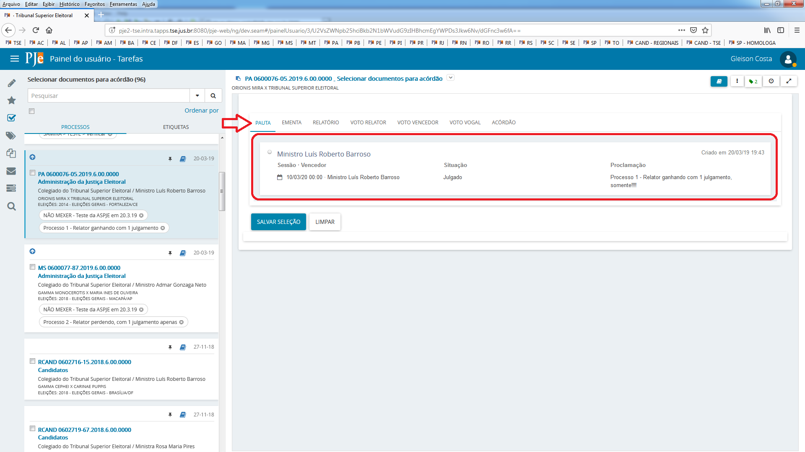

Como se pode ver pela área marcada, o registro contém:  

1.   O nome do órgão julgador que pautou o processo (Ministro Luís Roberto Barroso ao lado do campo de opção - círculo vazado); 

2.   A sessão junto com o voto vencedor (10/03/20 - Ministro Luís Roberto Barroso);

3.   A situação ao final da sessão (Julgado); 

4.   A proclamação (Processo 1 - Relator ganhando com 1 julgamento somente);

5.   O momento de inclusão na pauta (20/03/19 19h43).

Se houver recursos internos vinculados, o sistema também exibirá os dados do recurso. 

As abas  Ementa, Relatório, Voto Relator, Voto Vencedor e Acórdão permitem a seleção de apenas uma opção de documento, mas a seleção não é obrigatória. Dessa forma,  se  não houver seleção  para  uma  determinada  aba,  ao  enviar  o processo para elaboração do acórdão, a aba correspondente não terá documento previamente construído. Essa seleção refletirá na elaboração do acórdão desde que, após selecionadas todas as opções conjuntamente, o usuário utilize o botão "Salvar seleção". 
 
 

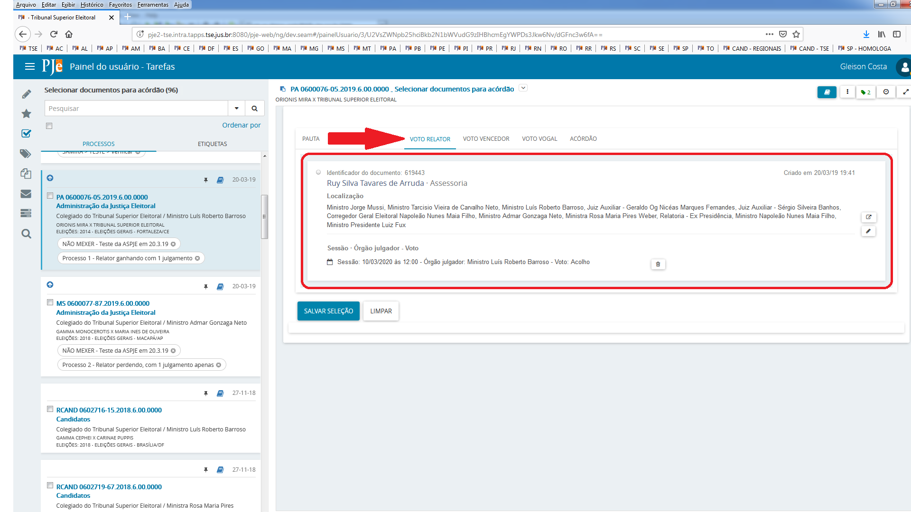

Para cada documento, serão exibidas as informações:

1.  Identificador do documento: esse número é o mesmo número pelo qual o documento pode ser visto, caso o usuário tenha permissão, na lista de documentos dos autos;
  
2.  O nome do usuário que incluiu o documento e o setor de inclusão do documento;
  
3.  Localização: as lotações que o usuário que incluiu o documento tinha no momento da inclusão;
 
4.  Sessão/Órgão julgador: a sessão à qual o documento está vinculado e o órgão julgador vinculado ao documento;
  
5.  Um ícone de visualização do documento;
  
6.  Um ícone para sinalizar que o documento já foi assinado, quando for o caso (cadeado fechado);
  
7.  Um ícone para permitir ajustar órgão julgador do documento (lápis);
  
8.  Um ícone para permitir desvincular órgão e sessão do documento (lixeira).
 
9.  Nas abas de voto é exibida indicação do voto. Por exemplo, "Nego provimento".

A aba de votos vogais permite a seleção de mais de um documento: 

As abas de votos (voto relator, voto vencedor e votos vogais) exibirão sempre  o mesmo conteúdo, ou seja, todos os documentos construídos e não excluídos da instância atual, cujos tipos sejam os configurados nos parâmetros: idTipoProcessoDocumentoVoto, pje:painel:magistrado:sessao:tiposVotoVogal:ids e pje:flx:votacaoVogal:tiposVoto:ids. 

A aba de ementa trará todos os documentos do tipo, configurado no parâmetro: idTipoProcessoDocumentoEmenta.

A aba relatório trará todos os documentos do tipo, configurado no parâmetro: idTipoProcessoDocumentoRelatorio.

A aba acórdão trará todos os documentos do tipo, configurado no parâmetro: idTipoProcessoDocumentoAcordao.
 
O ícone de lixeira desvincula o documento correspondente à sessão/órgão julgador vinculados:

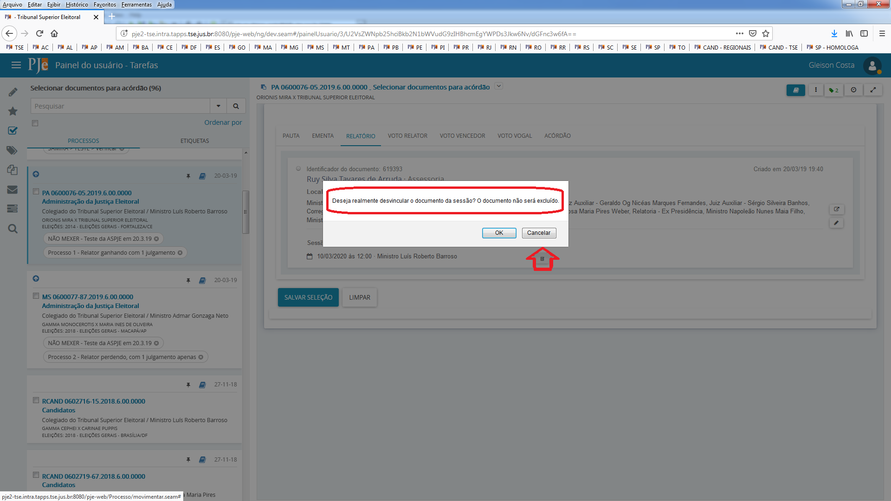

O ícone de lápis permite que o documento correspondente seja vinculado a um órgão julgador:

O ícone de seleção permite a visualizaçao do conteúdo do documento:

O ícone de cadeado fechado permite a visualização dos assinadores do documento, quando existirem:

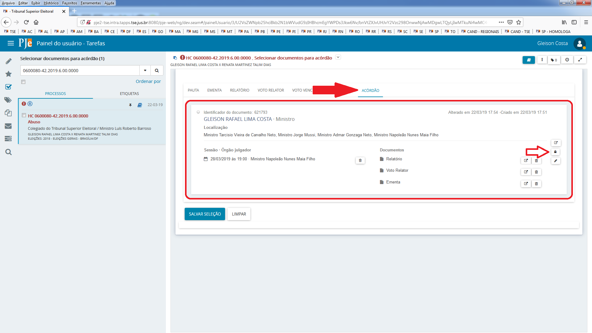

1. Caso não seja selecionado um acórdão na aba correspondente, o sistema criará um documento de acórdão em branco e o utilizará na tarefa seguinte.

2. Na tarefa de elaboração do acórdão, a aba de seleção de documentos para o acórdão, além dos documentos já carregados pela regra atual,  incluirá os documentos que tenham sido marcados na tarefa de seleção de documentos.

3. Caso alguma aba da tarefa Selecionar documentos para acórdão não tenha seleção de documento correspondente, o elaborar acórdão deverá carregar, em lugar do documento não selecionado, um documento em branco para que o usuário possa construir um novo, de acordo com as permissões já existentes na elaboração de acórdão. 

4. Ao selecionar  "Salvar seleção",  o sistema  notificará  o  usuário sobre  a seleção realizada. O alerta avisará quais abas não tiveram documentos selecionados. É só um alerta. 
 

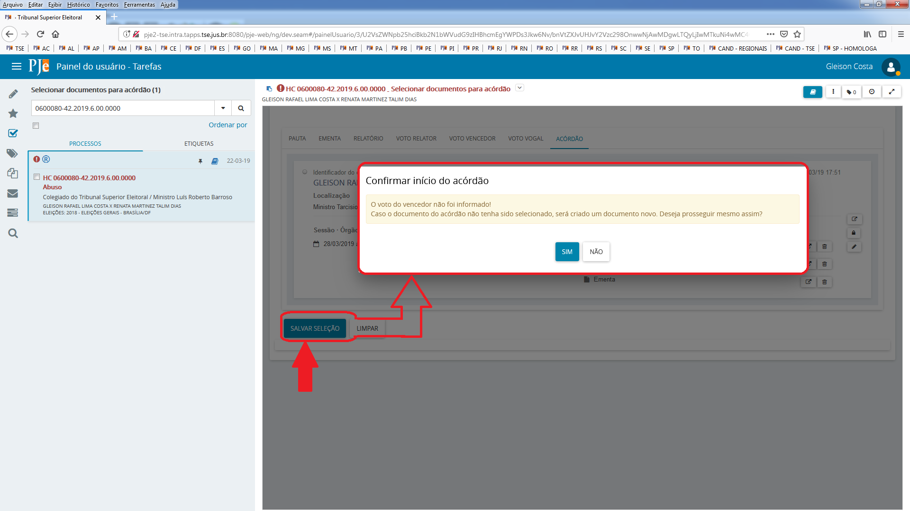

5. Ao selecionar "Não", o sistema não gravará a seleção. Ao selecionar "Sim", o sistema exibirá uma mensagem notificando as divergências relacionadas à seleção. 

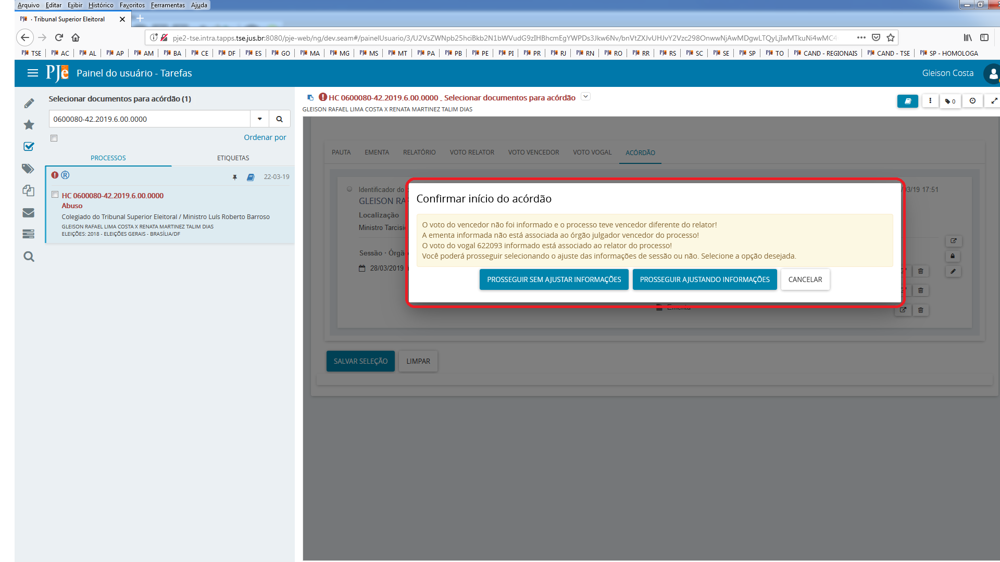

As possíveis divergências serão notificadas ao usuário quando:

•	O voto do relator não for do gabinete que pautou o processo;

•	O relatório não for do gabinete que pautou o processo;

•	O voto do vencedor não for do gabinete vencedor do julgamento;

•	Os votos de vogais estiverem vinculados ao gabinete que pautou o processo;

•	A ementa não for do gabinete vencedor do julgamento;

•	O acórdão não for do gabinete vencedor do julgamento;

•	Os documentos não estiverem vinculados à sessão ou estiverem vinculados à sessão distinta da sessão selecionada.

O usuário poderá selecionar "Cancelar" para desistir da seleção. Pode selecionar "Prosseguir sem ajustar informações", o que, em alguns casos, fará com que os documentos selecionados possam não ser devidamente carregados na tarefa seguinte. Ao selecionar "Prosseguir ajustando informações", o sistema vinculará todos os documentos à sessão selecionada.

Não selecionando o botão "Cancelar", o sistema exibirá a mensagem de que a seleção foi gravada com sucesso.

As  atualizações  realizadas  podem   não  estar  disponíveis  de  imediato  nas  abas.  Atualize a  página para poder verificar, caso tenha solicitado "Prosseguir ajustando informações".

O  usuário  poderá  selecionar, pelos três pontinhos da tarefa, prosseguir por meio do "Elaborar acórdão ou resolução" ou "Iniciar novo fluxo de acórdão", caso tenha mais de
um acórdão para construir.

## Perfil de consulta  

No ambiente do  primeiro grau,  há  um perfil de servidor chamado "Consulta de processos para servidor de outra instância". Nesse perfil só é permitida a consulta processual
e  não  é  possível consultar processos sigilosos.  O cadastro dos usuários vinculados a esse perfil  deve  ser  feito  pela  funcionalidade  "Configuração/Pessoa/Servidor", selecionando órgão julgador ou selecionando Estado e na opção Papel, o nome desse perfil.

Para o ambiente do segundo grau, os servidores administradores  podem fazer o cadastro do perfil.  Para isso, basta em "Configuração - Controle de Acesso - Papéis", criar um papel com o nome "Consulta de processos para servidor de outra instância" com identificador "consulta". Depois de criado, na aba "Herdeiros"  desse  papel,  vincula  o papel "Colaborador", e na aba "Recursos" associa o recurso "Página Processo/Consulta/Consulta de Processo".

O cadastro dos usuários vinculados a esse perfil deve ser feito de forma similar ao primeiro grau, ou seja, pela funcionalidade "Configuração/ Pessoa/Servidor", selecionando órgão julgador ou não, selecionando Colegiado ou não, selecionando em localização a opção Tribunal Regional Eleitoral e, na opção Papel, o nome desse perfil.

##  Prazo em horas 

O prazo em horas, no PJe, tem problemas que necessitam de correção, e enquanto elas não vêm, a recomendação é que se converta em dias.

Sem  que  isso  impacte  diretamente  na questão e na necessidade de evolução do sistema, a jurisprudência do TSE é bem farta no que se refere à conversão de prazos em horas 
para prazos em dias: 

TSE - Agravo Regimental em Agravo de Instrumento AgR-AI 85876 GO (TSE).

Jurisprudência • Data de publicação: 11/02/2011.

AGRAVO REGIMENTAL.AGRAVO DE INSTRUMENTO.RECURSO ESPECIAL ELEITORAL.CAPTAÇÃO ILÍCITA DE SUFRÁGIO.  ELEIÇÕES  2008.CONTAGEM  DO PRAZO EM HORAS.CONVERSÃO EM DIA. POSSIBILIDADE. NÃO PROVIMENTO.1 . O prazo fixado em horas pode ser convertido em dias. (Precedentes: AgR- ED -Rp nº 789/DF, Relator designado Min. Março Aurélio Mello, PSESS de 18.10.2005; AgR-AI nº 11.755 /GO, Rel. Min. Arnaldo Versiani, DJe de 23.6.2010). 2. Agravo regimental não provido.

TSE - RESPE: 2521020126040051,  Presidente Figueiredo/AM 30642013,  Relator: Min. Henrique Neves Da Silva, Data de Julgamento:  12/06/2013, Data de Publicação: DJE Diário de justiça eletrônico - 18/06/2013 - Página 41-42.

TSE - RESPE: 69795520106060000  Fortaleza/CE 17632012, Relator:  Min. Henrique Neves Da Silva,  Data de Julgamento: 01/08/2013,  Data de Publicação: DJE - Diário de justiça eletrônico - 05/08/2013 - Página 340-343.

##  Remessa entre instâncias 

## Remessa para outra instância:

“Remessa  para  outra instância” tarefa exclusiva do PJE do 2º grau, deve ser utilizada quando o objetivo seja enviar um processo que tenha iniciado no TRE, para o TSE. Deve ser utilizada também, quando o processo foi iniciado físico na Zona Eleitoral, migrado no TRE, e precisa descer para o 1º grau.

Essa  tarefa  permite que se protocole um “novo processo” no destino, com classes e assuntos específicos e com  novas configurações de partes. As classes exibidas são as que estejam  configuradas  na instância de destino como remessa entre instâncias  “Sim”. Caso a classe selecionada esteja configurada no destino com a marcação  “exige numeração própria”,  um  novo número de processo será gerado. Essa remessa lança o movimento de código 123: remetidos os autos, com os seus complementos cadastrados, bem como o código 22: baixa definitiva.

Após a confirmação, o sistema movimentará o processo para a tarefa “Aguardando apreciação de outra instância” onde ficará bloqueado para novas petições ou edições.

## Expedir processo -  Retorno à origem

"Devolver processo à origem",  tarefa  exclusiva  do 2º e 3º grau: deve ser utilizada quando o objetivo seja devolver um processo para alguma instância em que ele esteve, ou seja, o processo deve existir na instância de destino (já deve ter ocorrido uma remessa entre instâncias no sistema).

Se o processo foi remetido do 1° grau para o 2° grau, devolver à origem é devolver para o 1° grau.

Se o processo foi remetido do 1° grau para o 2° grau e depois para o 3° grau, devolver à origem é devolver para o 2° grau e, em seguida, para o 1°grau.

Se o processo foi remetido do 2° grau para o 3° grau, remeter à origem é devolver para o 2° grau.

É possível também, utilizando essa tarefa, retornar para o 3º grau um processo que se iniciou no 3º grau e foi remetido para o 2º.

Se  o  processo se  iniciou  no  1º grau, foi remetido para o 2º grau e depois para o 3º, ao retornar para o 2º grau, lá será apresentada uma opção para que o usuário decida se deseja remeter para o 1º grau ou para o 3º grau. Essa remessa lança o movimento de código 22: baixa definitiva.  Após a confirmação, o sistema movimentará o processo para a tarefa “Manter processos expedidos” e ele ficará bloqueado para novas petições ou edições.

As tarefas onde os processos permanecem após remessa ou devolução são diferentes para que se saiba com mais facilidade qual o caminho que o processo percorreu.

Como a tarefa funciona: a  tela da tarefa permite  a seleção do motivo da  devolução e o acionamento do botão “Retornar para a instância de origem”, porém, nesse momento,  o sistema verificará se há documentos não assinados, expedientes abertos ou tarefas em  andamento, de modo  a evitar que o processo seja encaminhado  sem o devido cumprimento.
Na confirmação da execução, o sistema retornará o processo para  a última instância de origem (se veio do TSE, retornará para o TSE, se veio do primeiro grau, retornará para o primeiro grau). 

O usuário pode também desistir da tarefa, retornando na tarefa “Retornar para Verificar Pendências”, ou encaminhar para novos cumprimentos,  por meio da transição “Necessita atos de ofício”. 

Na confirmação da execução, o sistema retornará o processo para a última instância de origem (se veio do TSE, retornará para o TSE, se veio do primeiro grau, retornará para o primeiro grau). 

## Remeter processo para o TRE

"Remeter ao TRE" (tarefa exclusiva do 1º grau): deve ser utilizada quando  o objetivo seja realizar a remessa de um processo da Zona Eleitoral para o TRE, independente de se  o processo já esteve ou não na instância de destino (2º grau).

No  ambiente  de zona, para remeter a outra instância, só existe hoje a possibilidade de utilizar o Remeter processo para o TRE, mesmo quando for devolução. De toda maneira,
o  sistema  sempre consulta  o processo na instância de origem, ao fazer a remessa.  Encontrando o processo lá, ele vai automaticamente  fazer  uma devolução, e não uma nova remessa. Essa remessa lança o movimento de código 123: remetidos os autos, com os seus complementos cadastrados, bem como o código 22: baixa definitiva.

Ao  utilizar  tarefa “Remeter processo para o TRE”, o processo fica em “Aguardando apreciação do TRE” e bloqueado para novas petições ou edições. Caso seja devolvido do TRE, deve ir automaticamente para o “Analisar processo – ZE" ou “Analisar determinações - ZE”, retirando o bloqueio de edições/novas petições.

O “ Retornar processo”  não tem nada a ver com remessa, ele só retorna o processo  de volta  para o "analisar determinação" ou "analisar processo", verificando os movimentos lançados para encaminhar para um ou outro. 

## Expedir processo – retorno à origem - outros órgãos   

"Expedir processo - Retorno à origem – outros órgãos" (tarefa exclusiva do 3º grau):  deve ser utilizada quando o objetivo seja remeter um processo ao TRE, quando o processo se iniciou no TSE, seja porque realmente foi protocolado no TSE, seja porque foi migrado no TSE. Nesse caso, o processo não “existia” no TRE. Essa  remessa lança o movimento de código 22: Baixa definitiva.

## Remessa a outra jurisdição 

Como ficam os processos após finalização?

O processo,  após  remetido a outra jurisdição, não fica na mesma tarefa. Se gera novo número (quando de um Estado para outro), é para ficar o número originário em  processo arquivado na Zona Eleitoral inicial,  e o novo número em analisar novo processo, na ZE de destino. Se não gera novo número (remessa entre Zonas do mesmo Estado), fica apenas um processo em analisar novo processo, na ZE de destino. 

## Artigo 260 no PJe 

Há uma especificidade da JE referente à distribuição de processos que afetam a eleição. Art. 260 do Código Eleitoral (CE) - Lei 4737/65: 

**Art. 260.** *A distribuição do primeiro recurso que chegar ao Tribunal Regional ou Tribunal Superior, prevenirá a competência do relator para todos os demais casos do mesmo município ou Estado.*

Perceba que o art. 260 é aplicável, apenas, aos recursos e incidentais, exemplos: tutelas de urgência e mandado de segurança, não sendo aplicado às ações originárias (representações e ações de investigação). 

Até as Eleições de 2020 a maioria dos Tribunais Regionais vinham optando, em sua maioria, por não utilizar o art. 260 do CE como critério de Distribuição. 

Ocorre que a Resolução TSE n.º 23.609 passou a prever, expressamente, a distribuição pelo art. 260: 

**Art. 64.** *Recebidos os autos no tribunal, a distribuição do recurso se fará:I por prevenção: a) ao relator do recurso do mesmo município que primeiro tiver chegado ao TRE ou ao TSE, quando se tratar de RRC, RRCI ou DRAP relativo ao cargo de prefeito ou vice-prefeito (Código Eleitoral, art. 260);b) ao relator do recurso do mesmo estado que primeiro tiver chegado ao TSE, quando se tratar de RRC, RRCI ou DRAP relativo ao cargo de governador ou vice-governador (Código Eleitoral, art. 260).* 

A Resolução TSE n.º 23.608, por sua vez, fez previsão de distribuição com base no art. 260 do Código Eleitoral para os recursos interpostos em algumas espécies de representações: 

**Art. 53.** *Ao aportarem nos tribunais regionais eleitorais ou no Tribunal Superior Eleitoral, os recursos interpostos nos autos das representações que versem sobre as hipóteses previstas nos arts. 30-A, 41-A, 45, VI, 73, 74, 75 e 77 da Lei n° 9.50411997 serão distribuídos com observância do art. 260 do Código Eleitoral.*

<u>Como consequência das configurações 260:</u> A escolha pelo usuário de qualquer dos assuntos abaixo listados na autuação de um processo fará com que novos processos que contenham "assuntos 260" e que sejam do mesmo ano de eleição e município, sejam distribuídos para o mesmo relator, com exceção das classes do item 2: 

1. Assuntos para o 260 (segundo a configuração feita pelo TSE, nada impede que os TREs, seguindo os normativos, realizem configurações diferenciadas, de acordo com a realidade local): 

    i. Abuso – Código CNJ 11717 

    ii. Abuso de poder econômico – Código CNJ 11718 

    iii. Abuso de poder político/autoridade – Código CNJ 11719 

    iv. Abuso – uso indevido de meio de comunicação social – Código CNJ 11720 

    v. Captação ilícita de sufrágio – Código CNJ 11721 

    vi. Propaganda política – propaganda institucional – Código CNJ 11723 

    vii. Conduta vedada a agente público – Código CNJ 11558 

    viii. Captação ou gasto ilícito de recursos financeiros de campanha eleitoral – Código CNJ 11685 

    ix. Corrupção ou fraude – Código CNJ 11722 

    x. Eleições – eleição suplementar – Código CNJ 11647 

    xi. Transgressões eleitorais – Código CNJ 11716 

    xii. Recursos financeiros de campanha eleitoral – Código CNJ 11684 

    xiv. Eleições - Eleição Majoritária - Código CNJ 11645. 

 

    **Dica:** No que se refere a recursos em registros de candidaturas, somente os processos de eleições majoritária são distribuídos com base no art. 260 do CE. Assim, como os assuntos de “registro” são comuns aos cargos proporcionais e majoritários, o assunto “Eleição Majoritária” foi criado para identificar os casos de distribuição pelo art. 260. 
    **Dica2:** Não utilizar, no ano da Eleição (caracteríticas do processo), "Eleições Suplementares", utilizar apenas "Eleições XXX - Eleições Municipais" ou "Eleições XXX - Eleições Gerais". 

2. Classes que excluem a aplicação do art. 260 do Código Eleitoral (segundo a configuração feita pelo TSE, nada impede que os TREs, seguindo os normativos, realizem configurações diferenciadas, de acordo com a realidade local). 

    i. AÇÃO DE IMPUGNAÇÃO DE MANDATO ELETIVO – Código CNJ 11526 

    Motivo: inexistência de previsão legal para distribuição pela prevenção do art. 260 do CE nas ações originárias. 

    ii. AÇÃO DE INVESTIGAÇÃO JUDICIAL ELEITORAL – Código CNJ 11527 

    Motivo: inexistência de previsão legal para distribuição pela prevenção do art. 260 do CE nas ações originárias. 

    iii. AÇÃO RESCISÓRIA – Código CNJ . 

    Motivo: nos termos dos arts. 76 e 77 do RISTF, aplicáveis a este Tribunal por força do art. 94 do RITSE, a ação rescisória será distribuída automaticamente, excluindo-se o Relator do processo cuja decisão se pretende rescindir. 

    iv. RECURSO CONTRA EXPEDIÇÃO DE DIPLOMA – Código CNJ 11533 e REPRESENTAÇÃO – Código CNJ 11541 contra cargo de Presidente da República e Vice (no caso do TSE) E contra cargo de Governador, Vice-Governador, Deputado Federal e Deputado Estadual ou Distrital (no caso dos TREs).

    **Observação:** No caso dos Recursos Contra Expedição de Diploma é possível deixá-los em PE2 nas Eleições Nacionais, uma vez que, neste caso não gera prevenção pelo art. 260 do CE e retirar a classe de PE2 para o período de Eleições Municipais, uma vez que, neste caso, gera prevenção pelo art. 260 do CE.

    Os assuntos abaixo não geram a prevenção do art. 260 do CE, uma vez que referem-se a processos originários para o TSE. 

    11634 - DIREITO ELEITORAL|Eleições|Cargos|Cargo - Presidente da República 

    11641 - DIREITO ELEITORAL|Eleições|Cargos|Cargo - Vice-Presidente da República 

    No caso dos Tribunais Regionais Eleitorais, deve-se aplicar a mesma regra para os assuntos inerentes aos cargos de Governador, Vice-Governador, Senador, Deputado Estadual e Deputado Distrital: 

    11632 - DIREITO ELEITORAL|Eleições|Cargos|Cargo – Governador 

    11639 - DIREITO ELEITORAL|Eleições|Cargos|Cargo – Vice-Governador 

    11637 - DIREITO ELEITORAL|Eleições|Cargos|Cargo – Senador 

    11630 - DIREITO ELEITORAL|Eleições|Cargos|Cargo – Deputado Estadual 

    11631 - DIREITO ELEITORAL|Eleições|Cargos|Cargo – Deputado Federal 

 

3. Como configurar o PJe para que o sistema entenda essas determinações: 

 

    Foram criados três agrupamentos de classes e assuntos (Menu Configuração - Tabelas judiciais - Agrupamento de classes ou assuntos) para contemplar as subdivisões de classes e assuntos mencionadas acima. Por mais que um tribunal opte por não utilizar a prevenção do art. 260, via de regra os agrupamentos já estão configurados, podendo sofrer alterações de acordo com a concepção local. 

 

    **PE1** - Agrupamento que habilita a prevenção do art 260 CE (apenas assuntos específicos) 

    **PE2** - Agrupamento que desqualifica processo a pertencer a uma cadeia (apenas classes específicas) 

    **PE3** - Agrupamento que desqualifica processo a pertencer a uma cadeia (classes E assuntos) 

 

    Foi criado um parâmetro com uma expressão lógica (utiliza operadores que são comuns na área de TI) para relacionar as regras e os agrupamentos. Por mais que um tribunal opte por não utilizar a prevenção do art. 260, o parâmetro já está configurado, mas com a propriedade "Situação" igual a "inativo". 

 

        listaAgrupamentosPrevencao260JE = ou+PE1,ou-PE2,ou-PE3 

 

    Sendo assim, para habilitar a prevenção do 260, deve-se alterar esse parâmetro para que a "Situação" seja "ativo". 

    **Observação:** a lista de classes e assuntos que se enquadram ou que são exceções está de acordo com o que foi especificado inicialmente na época que a pendência foi codificada. Nada impede que seja alterada. 

4. Como incluir assuntos em PE1 e PE3 ou classes em PE2? 
 

    Para incluir novos assuntos em PE1 ou PE3 o configurador deve seguir os seguintes passos: 

    a) Menu; 

    b) Configuração; 

    c) Tabelas Judiciais; 

    d) Agrupamento de classes ou assuntos; 

    e) Selecionar o botão de editar em PE1 ou PE3; 

    f) Escolher a opção “Assuntos Vinculados ao Agrupamento” 

    g) Descer a barra de rolagem até o fim para verificar os assuntos já adicionados; 

    h) Subir a barra de rolagem, pesquisar o assunto e, em seguida incluir por meio do botão do lado direito ao respectivo assunto encontrado. 

    Para incluir novos classes em PE2 o configurador deve seguir os mesmos passos acima, com exceção do item “f”, em que deverá optar por “classes judiciais vinculadas ao agrupamento”. 

### Checklist para conferência de formação de novas cadeias

Um processo deveria ter formado uma nova cadeia de prevenção, mas aparentemente não formou? O passo a passo abaixo foi criado para auxiliá-lo na conferência de sua configuração e distinguir se é um erro de configuração ou de fato foi um equívoco do sistema. 

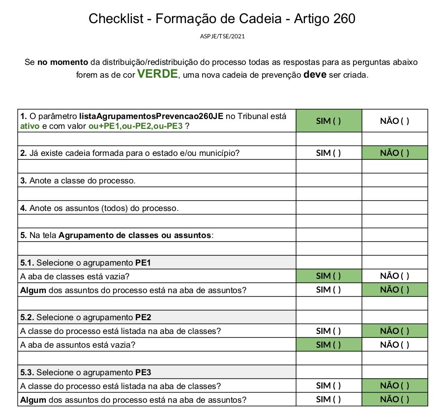

Siga o passo a passo e, em caso de eventuais dúvidas, envie um email para <aspje@tse.jus.br>.

## Definir revisor 

Um processo, ao ser protocolado, vai incluir o nome do revisor automaticamente, se a classe tiver marcada como "exige revisor". Nesse caso, na configuração do órgão julgador colegiado, temos que colocar quem é o revisor padrão de cada gabinete. 

Se a classe estiver marcada com revisão facultativa, o processo pode ou não ter revisor.  

Após o protocolo de processos, dependendo da atualização do fluxo, existe uma tarefa depois do "analisar determinação" que permite a  determinação  do revisor para processos cujas classes tenham revisão marcada como facultativa. Se assim estiver, a tarefa permite  que se marque ou desmarque  que  o  processo  exige revisão e também permite que o revisor seja alterado. 
 
Você poderá verificar o nome do revisor pelos autos digitais, na opção de exibir mais detalhes do cabeçalho. 

Quando  um  processo  está  no fluxo de colegiadas, na tarefa “Conferir relatório, voto e ementa”, o sistema verifica se o processo exige revisor, e isso foi selecionado  no protocolo, ou se o processo tem uma classe que a revisão é facultativa.  Se  uma  dessas condições for  satisfeita, aparece uma transição para que o usuário envie o processo para o revisor, que será o que aparece nos autos. 

Quando a classe exige revisão, o processo só poderá ser pautado se o revisor tiver incluído o voto. 

Para fazer alteração de um revisor já cadastrado no processo, deve-se, primeiramente, ajustar a configuração dos órgãos julgadores revisores, colocando-se o órgão que será o novo revisor no local daquele que está atualmente cadastrado. Para  tanto, acessar  o  menu "Configuração - Órgão julgador colegiado" - aba órgão julgador). Tal procedimento não  causará  mudança  nos  processos  que  já estão com seus revisores cadastrados. A seguir, deve-se  marcar  a  classe  com  "exige revisor" facultativo, depois colocar o processo,  a  partir  do analisar determinação,  na tarefa  de definir o revisor. Desmarque a opção de exige revisor e clique em Prosseguir. Retorne o processo para a tarefa Definir revisor.  Na  tarefa,  alterar  as  marcações  exige revisor e nome do revisor, deixando selecionado  o  revisor  correto, retornando depois o processo para analisar determinação.  Esse  procedimento  de  retirar da tarefa e colocar novamente é necessário porque a tarefa não tem o botão Salvar.  Após finalizado o procedimento, conforme o caso,  alterar  novamente a configuração do colegiado (Configuração - Órgão julgador colegiado - aba órgão julgador) para que novos processos protocolados não sejam afetados pela alteração.

Pode ocorrer também a situação em que o processo tem uma classe que exige revisão, mas o julgamento será do recurso. O procedimento correto  é marcar facultativo para  exige revisão na classe e pautar  o processo após o procedimento. Nesse caso, quem  envia o processo para a pauta é o relator, não o revisor. Depois,  pode-se  alterar a classe de volta. Se o processo já tiver sido pautado, pode-se fazer o seguinte: 

-  Tirar da sessão: para processo com pauta fechada, o sistema gerará a certidão de cancelamento de pauta; 

-  Marcar a classe como facultativo, em “exige revisor”;

-  Ir na tarefa “Analisar determinação”: pode-se cancelar a decisão colegiada e remeter o processo para SJD. Os documentos construídos de voto, relatório e ementa não serão perdidos; 

-  Tirar o revisor pela tarefa;

-  Colocar na sessão novamente: adicionar por mesa na sessão de julgamento. 

Dessa forma, pode-se alterar a ordem de votação do processo, já que com o revisor o sistema não permite. 

 

## Advogado não validado

Por vezes, o cadastro do advogado no PJe é feito mesmo o advogado estando com problemas na OAB, o sistema permite e o cadastro é realizado.

Nesse momento, o PJe, ao acessar a OAB, guarda os dados da validação realizada. Após realizar novas validações, o sistema não apaga as anteriores.

Quando se cadastra um advogado no processo, seja na autuação ou na retificação da autuação, o PJe realiza nova validação, e nesse momento pode ocorrer de virem dados de uma validação mais antiga, em que ele estava com o cadastro, por qualquer motivo, irregular.  

Se você, como servidor, sabe que aquele advogado está regular, não há problema, isso é só um alerta que aparece apenas para os servidores. 

## Situação das partes no processo: Suspensa, inativa e baixada

Parte  suspensa  é  aquela que no processo criminal, na fase de execução da sentença, está cumprindo normalmente as medidas restritivas a qual foi condenado. Se ele para de cumprir o que foi determinado na sentença, volta a ficar ativo no processo.

Parte inativa  (situação da  parte  marcada como "I") e parte baixada (situação da parte marcada como "B") é a parte cuja relação processual foi extinta por qualquer motivo.

A diferença entre elas é que as partes baixadas ainda podem ser utilizadas como parâmetro nas consultas processuais, e são retornadas no detalhamento do processo. Quando se utiliza as partes inativas como parâmetro na consulta processual, os processos respectivos não serão retornados. 

## Intimação de pessoa representada por defensoria 

Não há restrições para se intimar via sistema uma pessoa física vinculada a uma defensoria, desde que pelo menos um defensor tenha feito o login. Se a pessoa física tiver o cadastrado validado, o sistema também permitirá o envio eletrônico. 

A  intimação  eletrônica  de partes vinculadas à defensoria é permitida. Não há restrições técnicas para se intimar via sistema uma pessoa física vinculada a uma defensoria. 

## Campo máscara no preenchimento de configuração da classe 

O campo  de  máscara  na  configuração da classe judicial  é  para quando é marcada a opção anterior de  processo referência.  Significa que ao digitar o número do  processo referência, o sistema vai colocar máscara, fazendo com que pontinhos e tracinhos apareçam no lugar certo. 

## Distribuição e pesos

As regras de distribuição do PJe se baseiam essencialmente na ideia de  que  cada processo representa  uma  determinada carga de trabalho, a que chamamos de peso, e que essa carga  é  resultado  da  composição de  alguns  aspectos inerentes ao processo judicial. As  características  adotadas foram: a classe processual, os assuntos processuais, a quantidade de partes componentes do processo, a existência ou não de situação de prevenção e circunstâncias próprias dos órgãos julgadores.

Ao criar um cargo judicial em um órgão julgador, o sistema pergunta se ele deve ser inicializado com os valores dos outros cargos existentes. Se sim, o sistema cria o cargo já com os pesos acumulados dos outros que já existem e estão recebendo distribuição.

Assim, para um magistrado que vai começar a atuar em uma ZE ou tribunal e não se deseja que ele inicie recebendo processos a mais, deve-se criar um cargo judicial dentro do órgão, com as seguintes características:

1.	Descrição: podem fornecer a que melhor lhe convir;

2.	Sigla: Podem fornecer a que melhor lhe convir;

3.	Cargo: Ministro; 

4.	Recebe distribuição: Sim; 

5.	Cargo Auxiliar: Não; 

6.	Divisor do peso do processo: 1.0;

7.	Ativo: Sim.

Ao  selecionar a  opção "Incluir",  o sistema exibirá a seguinte mensagem: "Deseja que o acumulador de cargos seja atualizado para não haver compensação na distribuição?"  A resposta deve ser "Sim". 

Após finalizada essa etapa, você deve vincular o magistrado como titular do órgão vinculado a esse novo cargo judicial.

Mais informações em: https://www.cnj.jus.br/wiki/index.php/Distribui%C3%A7%C3%A3o 

As regras de cálculo dos pesos estão no item 4 de: 

https://www.cnj.jus.br/wiki/index.php/Distribui%C3%A7%C3%A3o#Procedimento_de_distribui.C3.A7.C3.A3o 

## Audiências
[Clique e acesse](audiencias.md)

## Unificação de pessoas  

A unificação  de  pessoas  existe  para que partes cadastradas repetidas vezes possam ser unificadas no  mesmo cadastro. Dessa forma, fica valendo o cadastro principal  e os outros que o usuário vincular  serão  enxergados como  a mesma pessoa. Pode-se fazer isso com pessoas físicas, jurídicas ou entes. Os processos em que as pessoas  unificadas estiverem cadastradas como partes serão todos refletidos de forma a prevalecer o cadastro principal. A unificação tem volta, ou seja, se você unificou um cadastro e percebeu que não era isso que você queria fazer, pode desunificar através do "Desunificar" que fica no menu Atividades. 

No entanto, se em um processo há outra parte cadastrada com a pessoa unificada, a desunificação não será possível. 

## Publicações no DJe – sigilo

A única propriedade que é levada em consideração para marcar uma publicação como sigilosa ou não, é se o processo é sigiloso. 

A dúvida surgiu  porque  na  tarefa  “Preparar ato de comunicação”,  no 2o  passo,  existe  a opção “sigiloso” ao lado do nome da parte. Marcar essa opção não  tem efeito na publicação do DJe, ou seja, se o processo não for sigiloso, os dados da parte aparecerão mesmo que esta opção esteja selecionada. 

Então qual a finalidade da opção “Sigiloso” na tarefa “Preparar ato de comunicação?” 

Marcar essa opção deveria refletir no documento que será criado/selecionado em “Instrumento de comunicação” após clicar no “lápis”. E diz  respeito ao sigilo do documento ao ser listado nos autos digitais. No entanto, a recomendação é NÃO utilizar essa marcação. Ela não se comporta como o esperado e precisará de correção. 
 

## Carta Precatória: Formas de Distribuir
 
Há duas formas de distribuir carta precatória ao juízo deprecado:

1. A  Carta  Precatória  é distribuída pelo deprecante diretamente na zona deprecada, observando-se a manutenção da numeração única do processo (da zona deprecada) e que os autos ficam vinculados a caixa do Procurador deprecado. 

2. A carta precatória é distribuída e os autos autuados na zona deprecante, sendo remetidos à zona deprecada, quando se observam duas situações possíveis: 

a. Quando a remessa é para outra zona do mesmo Estado, a numeração permanece e, a princípio, o processo ainda fica vinculado na caixa  do Promotor deprecante. Entretanto, no primeiro ato de comunicação, o processo migra para caixa correta, ou seja, na primeira intimação ao Ministério Público, o promotor  do juízo deprecado é comunicado, de forma a ser viabilizada a atuação; 

b. A remessa entre zonas de Estados distintos não é praxe, entretanto, tecnicamente, quando a remessa é para zona de outro Estado o número do processo é alterado (art. 5º da Resolução CNJ n.º 65/2008), mas  as partes permanecem as mesmas, ou seja, não atualiza para o Ministério Público do Estado deprecado. Neste caso, é necessário que o Cartório Eleitoral deprecado atualize os dados do processo, de forma a inserir o Ministério Público deprecado na autuação.

A despeito de todas as viabilidades técnicas, recomenda-se a utilização da primeira opção, qual seja, autuação diretamente na zona eleitoral deprecada. Este é o procedimento mais seguro e tendente a resolver a demanda sem necessidade de adequações (sejam automáticas ou manuais).

## Minutar em lote

As  tarefas  de  construção  de  documentos  como  minutar  ato  ou  elaborar documentos, podem ser executadas individualmente ou em lote (mais de um processo por vez). Para construir documentos em lote, deve-se selecionar os processos de alguma tarefa  onde  a minuta em lote esteja habilitada (atualmente quase todas estão), por meio do campo de seleção disponível ao lado do cabeçalho do processo. 

Pode-se, também, selecionar todos os processos da página por meio do campo de seleção que fica logo abaixo dos agrupadores de PROCESSOS/ETIQUETAS.  Selecionando  essa opção, todos os processos daquela página serão incluídos no lote. Lembramos que o limite de processos por página é 30.  

Seguem  imagens de exemplos de como ficam  os processos  e os ícones abaixo dos agrupadores de PROCESSOS/ETIQUETAS, após  selecionados os processos para  os quais se deseja construir documentos em lote: 

O minutar em lote está habilitado, já que o ícone correspondente é exibido: 

Ao selecionar o ícone do minutar em lote, a seguinte tela é exibida: 

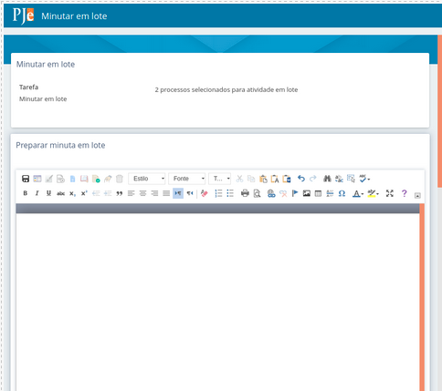

A edição do documento é similar à edição do documento individual, ou seja, deve-se selecionar o tipo e o modelo no ícone correspondente: 

Perceba que o ícone de assinatura fica sempre desabilitado no minutar em lote. A assinatura em lote no PJe é sempre realizada pelo item “Assinaturas” do painel de tarefas. Por isso o ícone do editor não pode ser usado. 

Ao selecionar o tipo e o modelo de documento, o sistema carrega, na área de exibição de texto do editor, o conteúdo do modelo de documento.  Se o  modelo contiver variáveis, elas serão carregadas sem a tradução, já que o sistema tem vários processos no lote e não exibirá na área de texto a tradução para cada documento. 
 

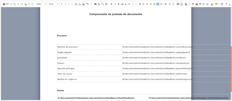
  
  
Ao salvar clicando no ícone correspondente, o sistema fará  a  tradução das variáveis  de acordo com cada processo. Finalizada a edição, o usuário pode simplesmente fechar a tela ou tramitar o processo para outra tarefa. Ao baixar a barra lateral de rolagem da tela, o sistema exibe as opções de tramitação, como na tela a seguir: 

Pode-se acionar o botão “Cancelar” e pode-se também alterar para quais tarefas cada processo irá a seguir, finalizando  a minuta por meio do acionamento do botão “Minutar  e movimentar os processos”. 

Se for acionado o botão “Minutar e movimentar os processos”, o sistema exibe um alerta para que o usuário saiba que os processos serão movimentados: 

Caso  seja  confirmada  a  movimentação,  o  sistema  exibirá um alerta para que o usuário não perca possíveis alterações que tenha realizado na área de edição do texto sem posterior acionamento do ícone para Salvar. Se o usuário já tiver salvo o documento, pode ignorar o aviso e prosseguir. 

Ao confirmar, o sistema tramitará o processo automaticamente para as respectivas tarefas selecionadas para cada processo. Se a próxima tarefa for uma tarefa de assinatura e o usuário tiver permissão para assinar aqueles documentos, os processos serão exibidos no item “Assinaturas” do painel de tarefas. 

No caso da tarefa “Elaborar documentos – ZE", não há necessidade de tramitação para uma tarefa de assinatura. Sendo assim, ao fechar a janela do “Minutar em lote”, seja pelo botão “Cancelar” ou pelo próprio ícone de fechamento da janela, os processos estarão com os documentos produzidos. Caso  o  usuário  tenha permissão para assinar os tipos de documentos, eles estarão disponíveis para assinatura, individual ou em lote. Se desejar assinar em lote, o usuário deve selecionar o item “Assinaturas”, disponível no painel do usuário. 
 

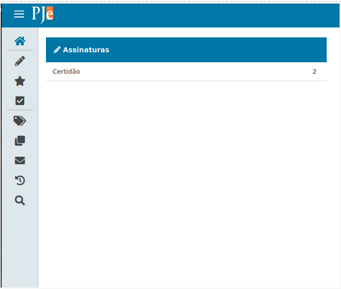

Pode ser que o painel não tenha sido atualizado com os documentos produzidos e o item  “Assinaturas”  não tenha  os documentos disponíveis para assinatura. Caso isso ocorra, clique no ícone do PJe no canto superior esquerdo da aplicação, que a tela será atualizada. 

A  assinatura  em  lote permitirá que se assine todos os documentos pendentes de assinatura. Pode-se também utilizar a opção de conferência, mas ela é opcional. Utilizando a opção  de  conferência  antes  da assinatura como método de trabalho, o usuário assinador pode optar por assinar apenas os conferidos, de forma a garantir que o conteúdo foi revisado por outra pessoa.

## Caixas de procuradores 

O PJe do primeiro grau tem uma funcionalidade em que, ao ser protocolado um novo processo, os filtros cadastrados nas caixas de advogados e procuradores são  automaticamente acionados, de forma a preencher as caixas com os processos respectivos.  O  acionamento  se dá no protocolo de novos processos, na redistribuição e na construção de atos  de comunicação.

O painel  do  procurador tem  jurisdições,  onde ele pode protocolar processos e acompanhar processos em que é parte ou foi intimado, e pode ter caixas ou não. Em geral,  as caixas que  existem  hoje  são  aquelas que foram criadas inicialmente, pela ASPJE, cujos nomes são os nomes das zonas. Essas caixas são uma sugestão de organização, apenas.

O procurador gestor é responsável pela gestão de suas caixas e pode  criar  filtros  de forma a distribuir os processos como melhor lhe prouver, por exemplo,  criando  caixa  para um procurador designado exclusivamente para determinado processo. No caso, ele vai usar a varinha mágica para arrastar o processo até a caixa.

Em versões anteriores à 2.1.2.6.17, quando o processo é remetido a outra zona, se não há mudança de UF, o número do processo permanece o mesmo. Para o sistema, o que ocorreu não  foi  um  novo  protocolo. Os  filtros não são acionados automaticamente nesses casos. Para eles, o procurador gestor deve utilizar a distribuição disponível por meio do ícone de seu painel, uma varinha mágica, que coloca cada processo na caixa respectiva.
 

## Filtros - procurador

1. Criando caixas:

- Não há restrições para os nomes das caixas;
- Não há restrições para a quantidade de caixas existentes;
- É possível definir quem vê cada caixa;
- Não é possível criar uma caixa dentro de outra caixa (subcaixas).

2. Criando filtros:

- Filtros da Caixa: indicar o critério utilizado para que os processos venham automaticamente para esta caixa;
- Pessoas Associadas: indicar quem pode ver esta caixa.

As caixas para o Ministério Público, no ambiente do primeiro grau da Justiça Eleitoral, foram, inicialmente, organizadas em Zonas Eleitorais, que por sua vez são vinculadas à Jurisdição do processo.
 

Pode-se, no entanto, organizar as caixas de várias maneiras. Exemplos:

- Organização de caixas por Procurador e/ou grupo de Procuradores:

- Organização de caixas por Procurador e/ou grupo de Procuradores em conjunto com a zona:

Se o procurador gestor desejar alterar a organização de suas caixas, não é necessário fazer a alteração de todas as caixas de uma só vez. Pode-se começar, por exemplo,  por uma zona  de  uma pequena jurisdição, adicionando as novas caixas de procuradores e definindo novos filtros. Após testar e avaliar, os procuradores gestores podem optar por implantar a solução para todas as caixas.

Opções na tela de filtros:

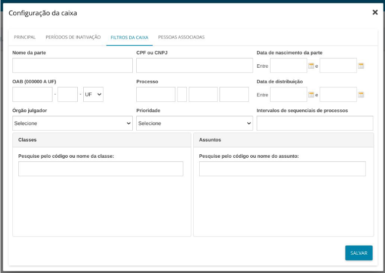

## Disponibilizando chaves de acesso aos documentos

[Passo a passo aqui.](chaves_de_acesso.md)

Exemplo:

## Meio de comunicação: Telefone

    

Para que o meio de comunicação Telefone apareça como opção na tarefa Preparar Ato de Comunicação, é necessário que a parte tenha pelo menos um número de telefone cadastrado.

    
    
   
   
## Variáveis de modelo 

Na construção de documentos, o usuário pode utilizar modelos preparados previamente para que algumas informações já venham preenchidas por padrão. Para recuperar valores na construção  de  um  documento  utilizam-se  variáveis.  Algumas  variáveis  foram  listadas [na wiki do PJe](http://www.pje.jus.br/wiki/index.php/Roteiro_de_configura%C3%A7%C3%A3o_de_documentos#Vari.C3.A1veis).

Outras referências de variáveis podem ser encontradas [aqui](variaveis.md).

## Etiquetas

[Clique e acesse](etiquetas.md)

## Papel para cadastrar etiqueta

É por meio dos PAPÉIS (Configuração/Controle de Acesso/Papéis) que se atribui essa permissão (o sistema chama isso de Recurso).

Para que um perfil tenha a permissão de criar etiquetas, ele precisa ter o recurso "Página Painel/Organização do Painel (Caixas)" a ele associado. 

Como os papéis funcionam de forma hierárquica (onde o papel hierarquicamente superior herda recursos e  papéis atribuídos ao papel inferior),  todos os papéis acima  do  que tiver esse recurso associado também terão permissão para criar etiquetas.

    
Na imagem acima você observa um exemplo de como e onde o recurso deve ser incluído. Neste caso, colocamos o  recurso no papel Servidor, de maneira  que  os  papéis que estão acima dele (Chefe de Seção, Coordenador, Secretário) também  terão  essa  permissão. 

## Erros de remessa que podem ser corrigidos pelo usuário

A remessa  é  uma  das tarefas em que mais ocorrem erros no sistema PJE, isso porque ela faz uma  série  de  validações  na  instância  de  origem e na instância de destino.

1.   CEP:

 
 
 
Esse erro aparece quando alguma das partes do processo está com o CEP inválido ou em branco. 

Para correção, basta ir ao menu dos autos processuais, na  opção "retificar autuação", aba "partes", clique em selecionar (parte), aba "endereço" e verificar o CEP de  todas as partes, procedendo a correção necessária (verificar inclusive advogados). 

Deve-se deletar as informações da remessa e preencher novamente, para nova tentativa de envio.

2. Tipo de documento:

 
 
 
Esse erro acontece quando existe, no processo a ser remetido, um documento que foi classificado por um tipo inexistente na instância de destino.

Para  correção,  deve-se, primeiro, verificar  qual tipo de documento deverá ser alterado, pesquisando o número do id  do  documento  na  árvore processual.  Após,  delete a remessa e tramite o processo para a tarefa  “Classificar documentos”,  altere o  tipo de documento para uma opção diferente. Ao fim dessa alteração, realize os procedimentos de remessa novamente.

3.  Falta de vinculação de ente ou autoridade:

 
 
 
Esse erro acontece porque o ente ou autoridade, quando criado, foi vinculado a uma pessoa jurídica cadastrada no sistema sem CNPJ.

Para correção, deve-se ir ao Menu: "Configuração/ Pessoa/Ente ou autoridade", do PJE da instância de origem e, após localizar  a autoridade informada  no erro, vincular,  na aba Formulário, uma pessoa jurídica que possua CNPJ. 

Outra opção, é corrigir o cadastro da pessoa jurídica vinculada no ente ou autoridade, incluindo o seu CNPJ.

Deve-se deletar as informações da remessa e preencher novamente, para nova tentativa de envio.

4.  Expedientes abertos:

 
 
 
Esse erro acontece quando o processo que está sendo remetido ainda tem algum expediente aberto. Normalmente o expediente que ainda está aberto é sem prazo.

Para  correção,  deve-se  deletar  a  remessa e  tramitar  o processo para a tarefa de “Fechar expediente manualmente”,  na qual os expedientes abertos deverão ser fechados.

Se,  quando  for  realizar  a  tarefa, não aparecer nenhum expediente em aberto, deve-se ir ao Menu: "Processo/Pesquisar/Consulta de prazos", pesquisar o número do processo, marcar os expedientes de status aberto e clicar em fechar expedientes em lote.

5.  Cadastro de pessoa:

 
 
 
Esse erro acontece quando na hora da remessa, por alguma instabilidade da integração com o sistema da Receita Federal, alguma parte ou pessoa que assinou algum documento no processo, não consegue ser cadastrada automaticamente na aplicação de destino.

Para correção, basta  que  o  Administrador  do Sistema do PJE da instância de destino, vá ao Menu:"Configuração/Pessoa/Física"  ou  "Jurídica", se for o caso, e,  na  opção  pré-cadastro, faça o cadastro manual do CPF ou CNPJ que constar no erro.

Após o cadastro, tentar novamente a remessa, sem a necessidade de apagá-la.

6.  Documento de identificação:

 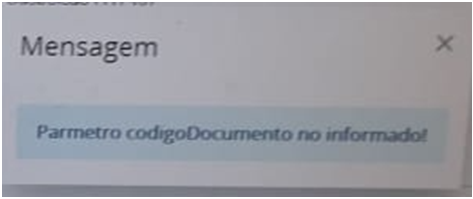
 
 
Esse erro acontece quando algum documento de identificação de uma das partes do processo está em branco.

Para correção, basta ir ao menu dos autos processuais,  opção  retificar  autuação,  aba partes, clicar em selecionar (parte), aba documentos de identificação e verificar os documentos constantes de todas as partes, procedendo  a  correção necessária (verificar inclusive advogados). 

## Distribuição de processos: Abas Criminais

Os processos criminais exigem informações adicionais para distribuição, são elas:

1. Aba **LOCAL DO FATO**, tem  como  campos  obrigatórios  a  Data  do  Fato, o Estado e o Município onde ocorreu o fato. Observações: O campo CEP não é obrigatório,  se for preenchido  o  sistema  carrega  os  dados  de  endereço, se não,  os  dados  podem ser informados manualmente.  O campo “Local do Fato” apesar do sinal de “*” ao lado, é de preenchimento opcional.
    
  
2. Aba **PROCEDIMENTO DE ORIGEM**, é obrigatório incluir pelo menos um (1) procedimento para conseguir distribuir o processo. É obrigatório também informar o Estado e o Tipo de origem.

3. Aba **INDICIAMENTO**, não é obrigatório, do ponto de vista de sistema, o cadastramento de incidências penais no momento da distribuição.

## Documentos que acionam o fluxo de petição avulsa no 1º grau

*Última atualização:* 11/03/2021

|Tipo de documento|
|-----------------|
|Agravo Inominado/Legal|
|Alegações Finais|
|Avulso|
|Avulsos|
|Certidão criminal da Justiça Estadual de 1º grau|
|Certidão criminal da Justiça Estadual de 2º grau|
|Certidão criminal da Justiça Federal de 1º grau|
|Certidão criminal da Justiça Federal de 2º grau|
|Certidão criminal de foro por prerrogativa de função|
|Contestação|
|Contrarrazões|
|Cota ministerial|
|Declaração de bens|
|Dissidência partidária|
|Documentos anexos a inicial|
|Embargos de Declaração|
|Execução / Cumprimento de Sentença|
|Extrato da Prestação de Contas|
|Impugnação|
|Impugnação aos embargos|
|Informação de candidato|
|Informações Prestadas|
|Laudo Pericial|
|Nota Explicativa|
|Notícia de Inelegibilidade|
|Parecer da Procuradoria|
|Petição|
|Petição (3º Interessado)|
|Petição Inicial|
|Petição de Habilitação|
|Procuração|
|Proposta de governo|
|Recurso|
|Recurso Adesivo|
|Recurso Eleitoral|
|Recurso Ordinário|
|Substabelecimento|

## Como cadastrar o Ministério Público, zonas eleitorais e Tribunais Regionais Eleitorais nos processos

###  Como cadastrar o Ministério Público no processo 

#### Como pessoa jurídica
1.	Acesse o menu Cadastro de Processo;
2.	Acesse “Partes”;
3.	Clique na parte em que você quer cadastrar: Polo ativo, Polo passivo, Outros interessados.
4.	No campo Tipo da Parte escolha o que quer cadastrar: Representante, Autor etc.;
5.	No campo Tipo de Pessoa clique no botão “Jurídica”;
6.	No campo Órgão Público clique em “Sim”;
7.	No campo Nome digite: “MINISTÉRIO PÚBLICO DO ESTADO DE PERNAMBUCO” (ex.).

Lembre-se sempre que o Ministério Público de todos os Estados já estão cadastrados no sistema.

No Distrito Federal o Ministério Público está cadastrado como Ministério Público do DF e Territórios.

#### Como ente ou autoridade
1.	Acesse menu Cadastro de Processo;
2.	Acesse “Partes”;
3.	Clique na parte em que você quer cadastrar: Polo ativo, Polo Passivo, Outros interessados.
4.	No campo Tipo da Parte escolha o que quer cadastrar: Representante, Autor etc.;
5.	No campo Tipo de Pessoa clique no botão “Ente ou autoridade”;
6.	No campo Ente ou autoridade, digite: “ PROMOTOR ELEITORAL DO ESTADO (UNIDADE DA FEDERAÇÃO). 

### Como cadastrar uma zona eleitoral no processo
1.	Acesse menu Cadastro de Processo;
2.	Acesse “Partes”;
3.	Clique na parte em que você quer cadastrar: Polo ativo, Polo Passivo, Outros interessados.
4.	No campo Tipo da Parte escolha o que quer cadastrar: Representante, Autor etc.;
5.	No campo Tipo de Pessoa clique no botão “Ente ou autoridade”;
6.	No campo Ente ou autoridade, digite: “JUÍZO DA XXXª ZONA ELEITORAL DE (MUNICÍPIO SEDE) MG” esse campo se autocompleta, mas você precisa obedecer exatamente a esse formato. 

Lembre-se que todas as Zonas eleitorais já estão devidamente cadastradas no sistema, sempre como Ente ou autoridade e no formato acima.

Portanto, solicitamos que NÃO se cadastre novas partes para Zonas Eleitorais.

### Como cadastrar um Tribunal Regional no processo
1.	Acesse menu Cadastro de Processo;
2.	Acesse “Partes”;
3.	Clique na parte em que você quer cadastrar: Polo ativo, Polo Passivo, Outros interessados.
4.	No campo Tipo da Parte escolha o que quer cadastrar: Representante, Autor etc.;
5.	No campo Tipo de Pessoa clique no botão “Jurídica”;
6.	No campo Órgão Público clique em “Sim”;
7.	No campo Nome digite: “TRIBUNAL REGIONAL ELEITORAL DE (UNIDADE DA FEDERAÇÃO) e clicar em pesquisar”.

Lembre-se que todos os tribunais Regionais Eleitorais já estão devidamente cadastrados no sistema como PESSOA JURÍDICA - Órgão Público, utilizando o seguinte padrão: TRIBUNAL REGIONAL ELEITORAL DE (UNIDADE DA FEDERAÇÃO).

**Obs.** A “Justiça Eleitoral” “Justiça Pública Eleitoral” é uma abstração, não existe como pessoa jurídica, ente ou autoridade, apesar disso temos mais de 500 processos autuados com essa figura cadastrada como ente ou autoridade.

Portanto, reiteramos que NÃO se cadastre novas partes desnecessariamente, para evitar o desencontro de informações e a poluição desnecessária da base de dados do PJE.

Essa orientação serve para todo o tipo de parte a ser criada: verifique se ela já existe no sistema. E, nos processos protocolados pelo público externo, adote o hábito de verificar se o cadastro feito pelo advogado está correto, caso contrário **RETIFIQUE** a autuação.

# Impedimento de Magistrados  

Para registrar magistrados impedidos/suspeitos nos autos de um processo é necessário ter o papel pje:papel:administrarAutuacao . A visualização também está vinculada a este papel. (Informação importante para os administradores do PJe)

O registro é feito por meio da aba Impedimento/Suspeição localizada no menu de três barras horizontais no canto superior direito dos autos, onde estão todos os magistrados vinculados ao órgão julgador ativo no TRE/TSE PJe:

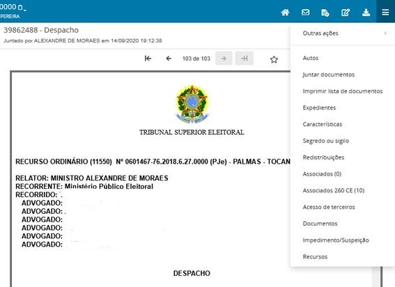

Para registrar o impedimento o usuário pode selecionar o magistrado e vincular a um documento assinado do processo. Nesse momento, o sistema pede confirmação do registro do impedimento e do documento selecionado: 

A partir daí, a lista de magistrados impedidos na tela é atualizada. O voto de impedimento proferido também atualiza a lista de magistrados impedidos, sendo todos exibidos nos autos do processo.

Atenção: os impedimentos/suspeições identificados a partir das características dos processos (município, estado, advogado, parte etc.), não atualiza essa lista. Para atualização da lista de impedidos para os autos é fundamental realizar um dos registros aqui indicados (via menu ou via voto do Ministro - vide parágrafo anterior).

A lista de impedidos é exibida por meio de ícone correspondente, na barra de ícones superiores do cabeçalho dos autos, ao lado do ícone de etiquetas:

Pode-se remover o impedimento registrado através da mesma aba:

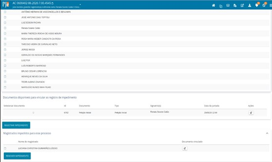

Na tarefa que exibe impedimento do relator (SJD), serão considerados também esses registros para apontá-los em conjunto com os outros existentes vinculados a regras específicas pelas características do processo, conforme o caso. 

Nas telas de sessão, no local (botão verificar impedimentos) onde eram exibidos os impedimentos dos magistrados do colegiado da sessão vinculados a regras específicas pelas características do processo, também serão exibidos os impedimentos por processo.

## Manual de sigilo PJe

[Clique e acesse](sigilo.md)

## Tipos de arquivos aceitos como anexo

É permitido o envio de até 40 arquivos por vez. A tabela a seguir lista
quais os tipos de arquivos aceitos, suas extensões e os tamanhos máximos permitidos.

|  Tipo de Arquivo  | Extensão | Tamanho Máx. Permitido (MBytes) |
|:------------------|:---------:|:--------------------------------:|
| application/pdf	| .pdf | 	10 |
| audio/mp4 | 	.m4a | 	5 |
| audio/mpeg | 	.mp3 | 	5 |
| audio/mpeg | 	.mpga | 	5 |
| audio/ogg | 	.oga | 	5 |
| audio/vorbis | 	.ogg | 	5 |
| image/jpeg | 	jpg | 	5 |
| image/png | 	.png | 	5 |
| video/ogg | 	.ogv | 	10 |
| video/mp4 | 	.mp4 | 	30 |
| video/mpeg | 	.mpeg | 	10 |
| video/quicktime | 	mov	 | 10 |
| text/html | 	.html | 	1,5 |
| audio/mpeg3 | 	.mpeg3 | 	5 |
| audio/mp3 | 	.mp3 | 	5 |

## Token PJe (PJe Mobile)

Como utilizar a ferramenta que permite ao usuário logar no PJe e assinar documentos sem a necessidade do certificado digital em token físico.

[Clique e acesse](tokenpje.md)

## Situação da inscrição do advogado na OAB

Como verificar a situação da inscrição do advogado na OAB, efetuar a revalidação
e as regras de negócio atuais do sistema.

[Clique e acesse](situacao_oab_advogado.md)
