# Etiquetas

Desde a versão 2.0 do PJe as etiquetas foram incluídas como um recurso para facilitar a organização dos processos nas unidades dos tribunais. 

Com elas, os usuários conseguem "marcar" os processos, agrupando-os de forma a acessá-los mais rapidamente de acordo com critérios estabelecidos pelo próprio usuário. É um recurso exclusivo do painel do usuário interno (servidores e magistrados) ou seja, do painel de tarefas.

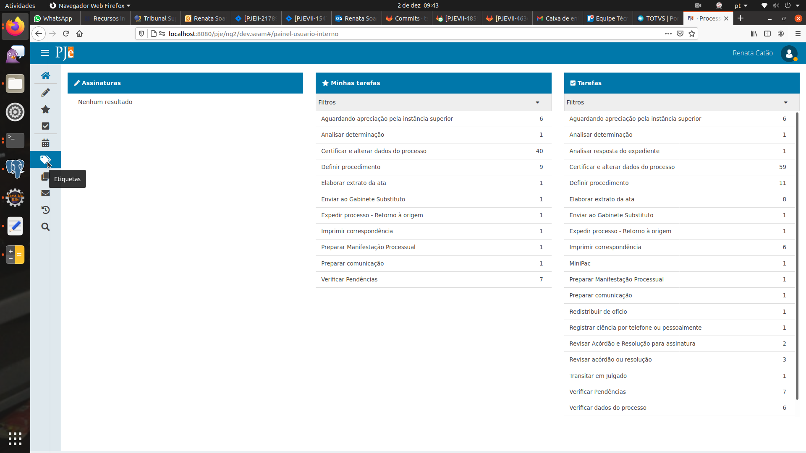

Descreveremos aqui como fazer uso das etiquetas, abordando especialmente as melhorias que surgiram a partir da versão 2.1.7.0.

## Criando etiquetas

No painel de tarefas, são exibidos os processos disponíveis nas tarefas que o usuário tem permissão de executar.

Um dos itens do painel é o ícone para criação/detalhamento das etiquetas.

Logo no canto superior da tela tem-se a opção de pesquisar etiquetas. Observe que, após acionado o ícone da lupa, as etiquetas exibidas na lista são só as pertinentes de acordo com o filtro utilizado.

O ícone de cruz (sinal de soma) pode ser usado para criar novas etiquetas.

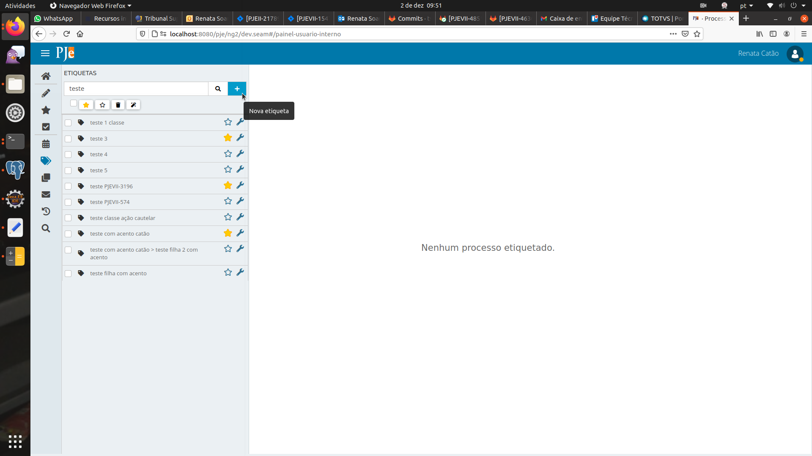

Para criar nova etiqueta, o usuário fornecerá o nome e selecionará o botão "Salvar". O nome utilizado pode conter espaços e acentos. Tente usar nomes que identifiquem a classificação desejada ao agrupamento de processos. Por exemplo, o nome de um servidor que está trabalhando naqueles processos ou referências a características dos processos. 

## Filtros de etiquetas

Após a criação da etiqueta, a tela de configuração dos filtros é exibida. 

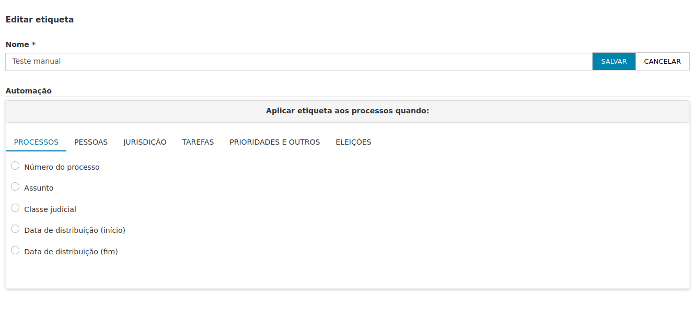

Os filtros são opcionais, mas são bem úteis. Eles permitem que os processos sejam vinculados a etiquetas automaticamente. Por exemplo, a servidora Ana cuidará, na unidade, de todos os processos cuja classe seja Mandado de segurança. Sendo assim, na aba Processos do cadastro de filtros, ele deve selecionar a opção "Classe judicial" e vincular a classe correspondente.

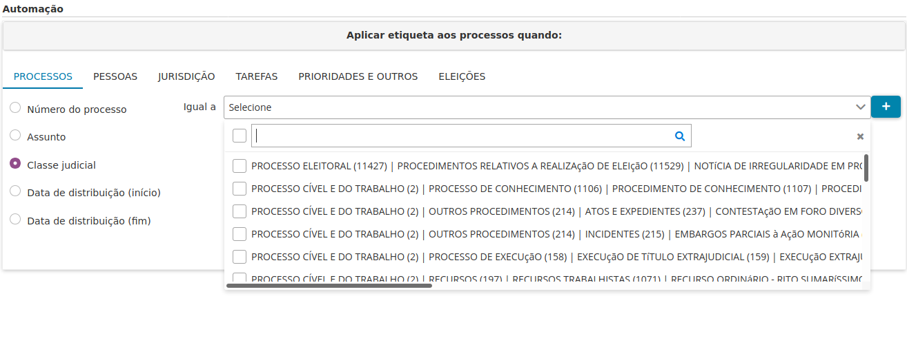

Observe que o campo de pesquisa que aparece ao clicar no ícone que exibe todas as classes possíveis para selecionar permite facilitar a busca pela classe.

A inclusão da classe no filtro se dá pela seleção da classe e pelo acionamento do ícone de cruz. (símbolo de soma)

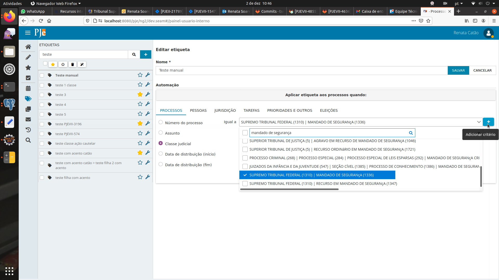

Pode-se também fazer uso de várias classes no mesmo filtro, ou seja, por exemplo, se desejar acrescentar, para a servidora Ana, processos da classe for "Agravo de instrumento" além dos mandados de segurança, deve-se selecionar a classe a adiconá-la. 

Observe que a regra, conforma seleção, é exibida mais abaixo, junto com o botão "Adicionar regra"

Ao adicioná-la por meio do botão, a vinculação da regra à etiqueta será exibida conforme abaixo:

A partir de então, todos os processos que atenderem a essa regra serão automaticamente vinculados à etiqueta quando chegarem as tarefas daquela unidade.

A vinculação da regra pode ser excluída a qualquer tempo. 

## Vincular etiqueta manualmente

O usuário pode também vincular processos a etiquetas manualmente, ou seja, selecionando o processo no painel de tarefas e vinculando-o à etiqueta que desejar. 

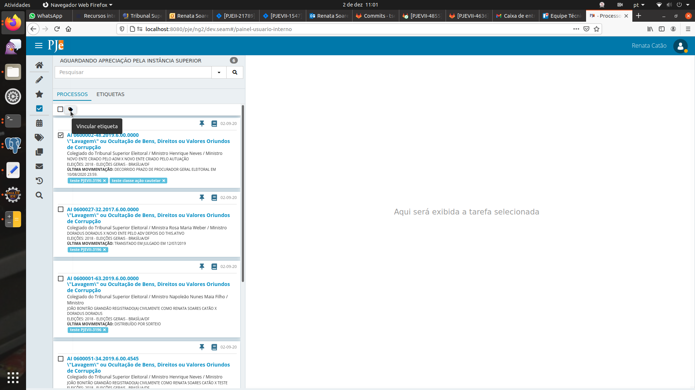

As etiquetas disponíveis serão exibidas e o usuário poderá vincular a uma ou mais etiquetas a lista de processos selecionados.

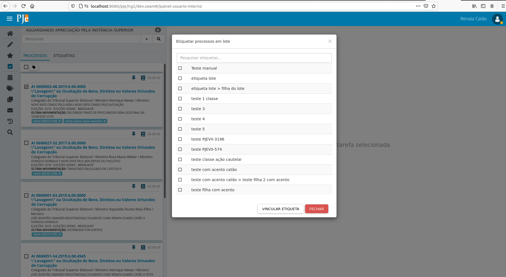

## Lista de processos 

Um recurso muito útil é o agrupamento de todos os processos da unidade por etiquetas, ou seja, ao clicar em uma etiqueta, se há processos vinculados a ela na unidade, são exibidos os processo independente de em qual tarefa ele está. Abaixo são exibidos os processos vinculados à "etiqueta lote":

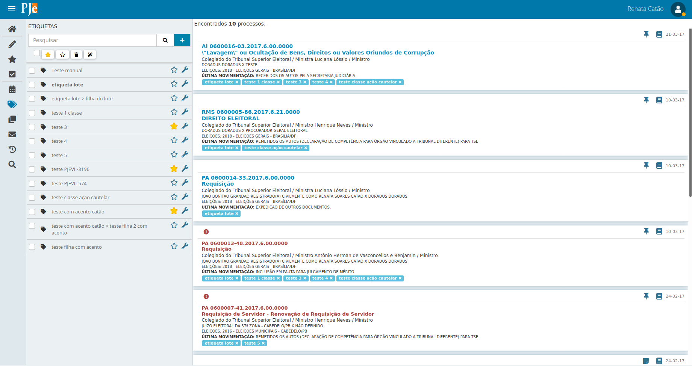

## Favoritar etiquetas

O painel de tarefas pode ser exibido de acordo com um tratamento diferenciado que o usuário queira dar a determinado conjunto de processos. Por exemplo, se o usuário deseja ver prioritariamente processos com pedido de liminar, ele pode criar ou editar uma etiqueta, e adicionar o filtro correspondente:

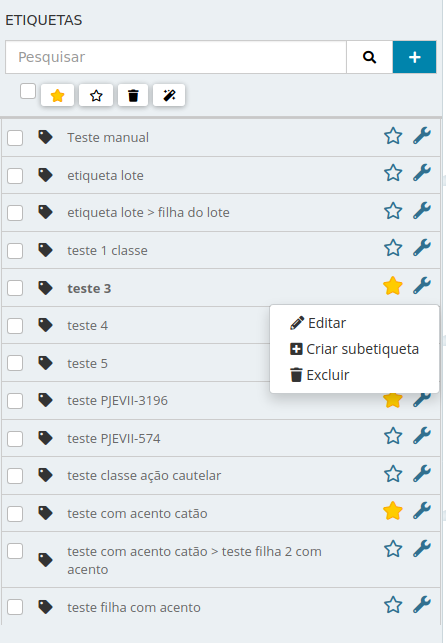

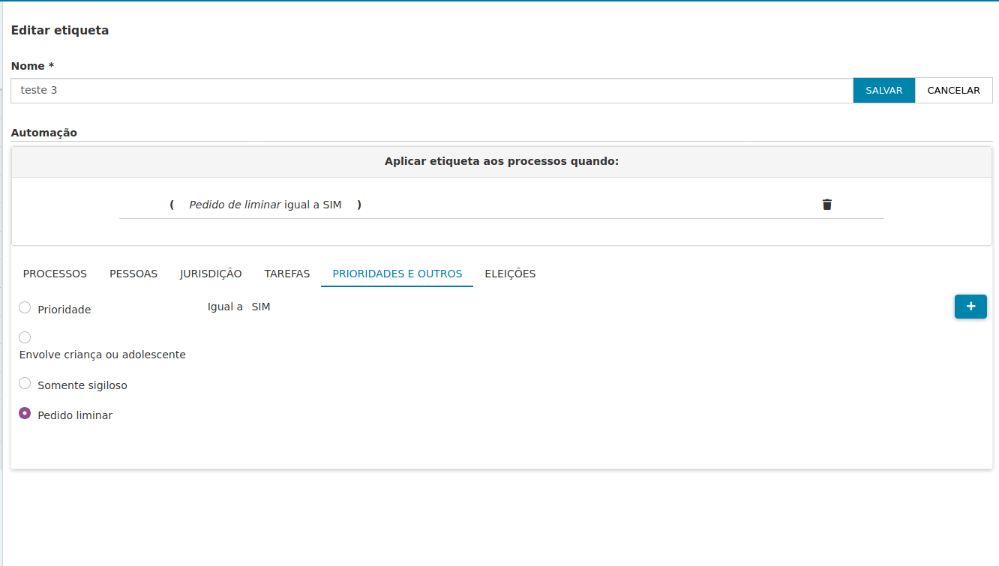

Ele pode marcá-la como "favorita", ou seja, selecionar a estrelinha na sua configuração, deixando-a amarela. 

Observe que processos vinculados a essa etiqueta são exibidos de forma separada na tela inicial do painel do usuário, por meio do quadro "Minhas tarefas".

No próprio painel de tarefas, uma das opções na barra de ferramentes lateral é a seleção do "Minhas tarefas".

As duas opções exibirão apenas os processos vinculados a etiquetas que foram marcadas como favoritas.

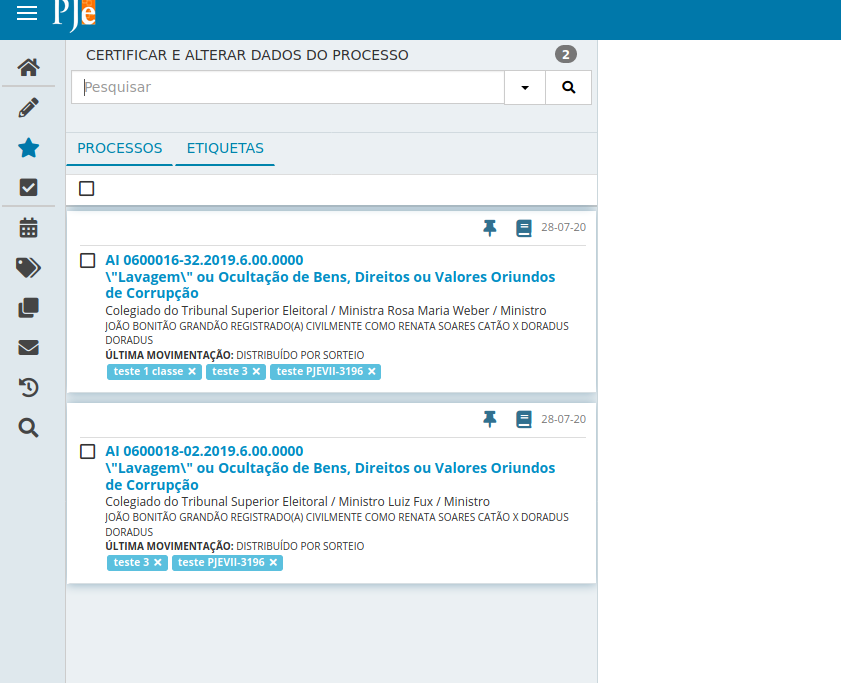

## Atuar em processos por meio das etiquetas

Ao selecionar uma tarefa para atuação, o usuário tem duas opções de atuação: Processos e Etiquetas.

Ao selecionar "Etiquetas", o sistema exibirá os nomes das etiquetas vinculas a processos naquela tarefa. Se há processo não etiquetados, o sistema exibe o identificador "Sem etiqueta". Ao lado dos nomes, o sistema exibe a quantidade de processos por etiquetas naquela tarefa. 

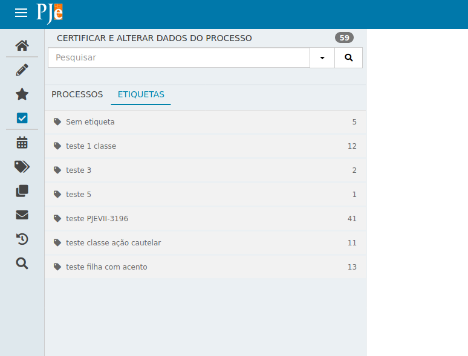

Se selecionar a etiqueta dos processos que deseja atuar, o sistema exibirá a lista de processo para atuação correspondente. 

Há usuários que preferem atuar pelas etiquetas sempre. Dessa forma, o sistema "lembra" da última seleção do usuário e, da próxima vez que carregar o painel, já carregará com a atuação por etiquetas selecionada por padrão:

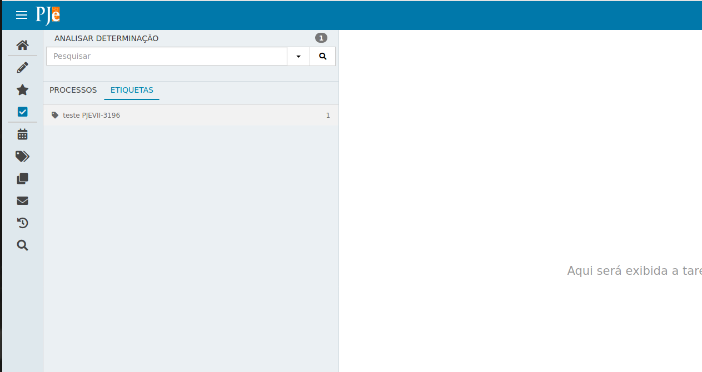

Da mesma forma, se selecionar a atuação por "Processos", a próxima seleção de tarefa "lembrará" da seleção.

## Automação com etiquetas

Para automação avançada utilizando etiquetas, assista ao vídeo de capacitação que o CNJ disponibilizou no [youtube](https://www.youtube.com/watch?v=GOLyiBMRKwo&feature=youtu.be)
