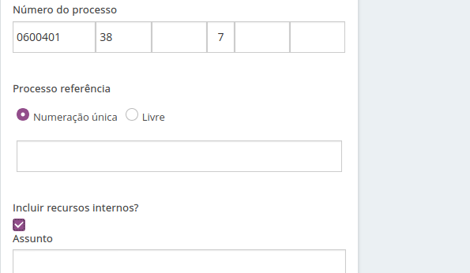
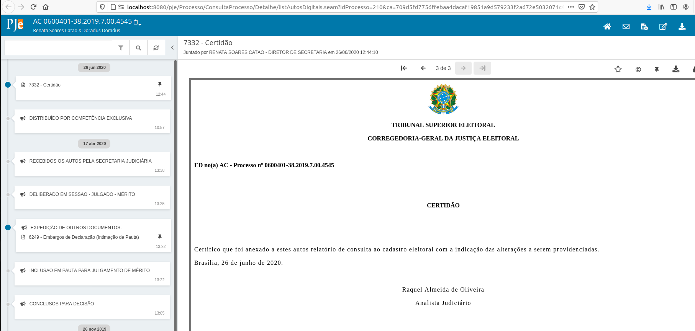
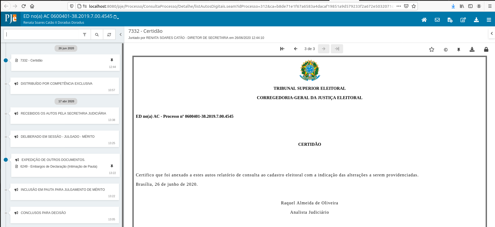
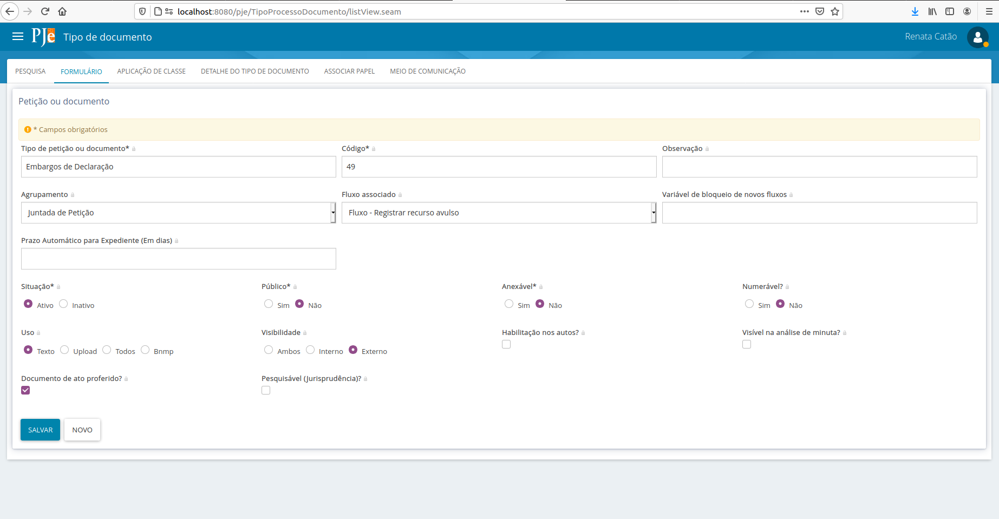
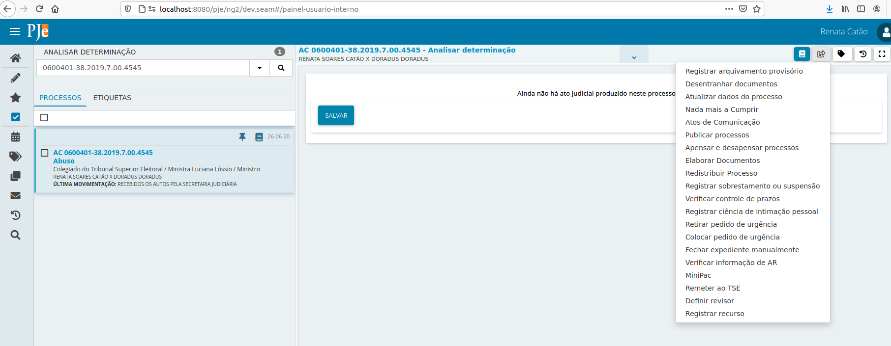

# Recursos internos

Quando interpostos os recursos agravo regimental, embargos de declaração e recurso extraordinário, impugnação ao registro e notícia de inelegibilidade não há alteração na numeração do processo. Não obstante, o processamento desses recursos é realizado de forma diversa, com partes de tipos diversos, decisões e julgamentos exclusivos do recurso. Além disso, é primordial para análise dos recursos identificar qual a origem do recurso, ou seja, se a parte está recorrendo de uma decisão do processo ou de uma decisão relacionada a outro recurso. 

Descreveremos aqui o mecanismo utilizado no PJe para que esse registro seja realizado de forma a permitir o tratamento diferenciado que a interposição requer. 

## Classes

Os recursos internos, apesar de serem interpostos por meio de documentos, são mapeados diretamente em classes processuais disponíveis nacionalmente no [Sistema de Gestão de Tabelas Processuais Unificadas](https://www.cnj.jus.br/sgt/consulta_publica_classes.php)

Sendo assim, ao serem registrados os recursos internos, o sistema fará a identificação por meio de uma nova capa processual vinculada ao mesmo número de processo com a classe vinculada ao recurso correspondente. Vejamos um exemplo na consulta processual de uma Ação Cautelar com um recurso interno vinculado:

Com a devida permissão, o usuário pode pesquisar outras capas vinculadas ao processo. Essa opção vem desmarcada por padrão, mas no caso de querer visualizar separadamente a capa do recurso, o usuário pode selecionar a opção "Incluir recursos internos" na pesquisa.

Veja o resultado da consulta:

Ao selecionar qualquer das opções, o sistema exibirá todo o conteúdo do processo, mas a "capa", ou seja, o cabeçalho superior dos autos será exibido de acordo com a seleção. Veja os autos com a capa original do processo:

Veja agora os autos com a capa processual gerada para o recurso:

Sendo assim, o PJe precisa estar com a configuração da classe Embargos de declaração como recurso interno para que seja possível registrar o recurso correspondente. Essa configuração já está feita por padrão. Colocamos aqui a informação para que o usuário saiba qual o impacto em alterar. A configuração da classe correspondente por meio do menu Configuração - Tabelas Judiciais - Classe Judicial - Classe Judicial deve estar assim:

Perceba que as informações importantes para o registro do recurso estão destacadas. Ou seja, a classe tem que ter o como Natureza como "RECURSO INTERNO", deve estar marcada como recursal e deve ter o tipo de documento inicial correspondente vinculado.

## Como é iniciado um recurso interno

Via de regra, o recurso é interposto quando o usuário externo (advogado, procurador, parte) inclui um novo documento expondo seu pleito. O documento, se classificado corretamente pelo usuário na interposição, terá o tipo correspondente à classe recursal interna. Ou seja, se o advogado, por exemplo, quer recorrer por meio de Embargos de Declaração em uma Ação Cautelar, ele deve selecionar, na tela correspondente, o tipo de documento Embargos de Declaração. Veja a tela de inclusão de documentos que o advogado tem acesso:

Ele deve selecionar a opção Embargos de Declaração para interpor o recurso correspondente. Ao finalizar a inclusão do documento, é iniciada uma tarefa "Registrar recurso" para que o servidor faça o registro.

Veja que a tarefa ser iniciada é resultado de uma configuração no tipo de documento. Conforme pode-se verificar abaixo, o tipo de documento Embargos de declaração tem um "Fluxo associado". É o fluxo que contém a tarefa registrar recurso. O sistema entende, desse forma, que ao ser inserido um documento desse tipo, será iniciada uma tarefa.

E o que fazer quando o advogado protocola um documento que não iniciou a tarefa de recurso?

Ao analisar os autos do processo, o servidor percebe que o documento de petição inserido pelo advogado é na verdade um recurso interposto. 

O servidor deve, então, iniciar a tarefa de registro de recurso.

Essa possibilidade se dá a partir da tarefa "Analisar determinação"

A tarefa de registro de recurso é criada:

## Registrando um recurso

### Classificar recurso

O primeiro passo no registro do recurso é a classificação. Na classificação, o servidor pode selecionar qual o documento principal do registro e também se o recurso foi interposto para o processo originário ou para um outro recurso, caso já tenham sido registrados recursos para esse processo anteriormente.

A lista de recursos já registrados exibe todos os recursos já registrados pelo servidor. Cada item corresponde a uma capa processual a mais já gerada para o processo originário.

A lista de recursos não registrados exibe todos os documentos vinculados a classes recursais classificadas como "RECURSO INTERNO" e que não estão ainda vinculados a uma capa processual recursal. Em outras palavras, o advogado protocolou um documento de embargos, mas o servidor ainda não registrou o recurso.

Mas o advogado protocolou uma petição contendo um registro de embargos e não é exibida na lista de recursos não registrados. Por quê?

Porque o servidor precisa reclassificar esse documento. A reclassificação acontece na mesma tela. O servidor deve fazer essa reclassificação por meio do ícone de lápis disponível na coluna Ações do documento de petição correspondente:

Ao selecionar salvar, veja que o sistema moverá o documento, que estava na lista "Outros documentos do processo" para a lista "Recursos não registrados":

Para o registro do recurso, é obrigatório que um item da lista "Recursos não registrados" esteja selecionado. Se o usuário tentar prosseguir sem a seleção, o sistema não permitirá, notificando que a seleção deve ser realizada:

### Confirmar cadeia / órgão julgador

O segundo passo no registro do recurso permite ao usuário confirmar como ficou a "Cadeia recursal" e alterar o órgão julgador de distribuição do recurso.

#### Cadeia recursal

A "Cadeia recursal" identifica, na forma de siglas ou nomes de classe encadeadas no cabeçalho da capa do processo, se o recurso tem como base uma decisão do processo ou uma decisão de outro recurso.

Observe o exemplo abaixo, em que o processo já tinha um recurso registrado. A tela mostra, em "Recursos já registrados", Embargos de Declaração já interpostos para o mesmo número do processo, ou seja, ED no(a) AC. 

Caso seja selecionado o recurso já registrado, o novo recurso será registrado com base no anterior, gerando a seguinte cadeia recursal:

Caso não seja selecionado o recurso já registrado, a cadeia terá apenas a classe do recurso novo e a classe do processo originário.

Por padrão, os cabeçalhos das capas processuais exibirão sempre a cadeia recursal com as siglas da classe, assim como já ocorre com o processo originário.

#### Alterar órgão julgador

Em alguns recursos, o julgamento do recurso terá como relator um órgão julgador diferente do originário do processo. Por exemplo, em Recursos Extraordinários interpostos no TSE, a competência do recurso é da presidência. O sistema permitirá que o usuário selecione um órgão julgador de distribuição do recurso diferente do órgão julgador originário do processo por meio dessa opção.

Se, no entanto, a seleção for equivocada e o usuário precisar ajustar, não há problemas. A possibilidade de se ajustar já no registro do recurso não impede ajustes posteriores, já que o recurso pode ser redistribuído a qualquer tempo, sem que isso resulte na redistribuição do processo originário ou dos outros recursos vinculados.

É válido salientar que a distribuição de recursos não impacta os pesos dos cargos.
