# Recursos internos

Quando interpostos os recursos agravo regimental, embargos de declaração e recurso extraordinário, impugnação ao registro e notícia de inelegibilidade não há alteração na numeração do processo. Não obstante, o processamento desses recursos é realizado de forma diversa, com partes de tipos diversos, decisões e julgamentos exclusivos do recurso. Além disso, é primordial para análise dos recursos identificar qual a origem do recurso, ou seja, se a parte está recorrendo de uma decisão do processo ou de uma decisão relacionada a outro recurso. 

Descreveremos aqui o mecanismo utilizado no PJe para que esse registro seja realizado de forma a permitir o tratamento diferenciado que a interposição requer. 

## Classes

Os recursos internos, apesar de serem interpostos por meio de documentos, são mapeados diretamente em classes processuais disponíveis nacionalmente no [Sistema de Gestão de Tabelas Processuais Unificadas](https://www.cnj.jus.br/sgt/consulta_publica_classes.php)

Sendo assim, ao serem registrados os recursos internos, o sistema fará a identificação por meio de uma nova capa processual vinculada ao mesmo número de processo com a classe vinculada ao recurso correspondente. Vejamos um exemplo na consulta processual de uma Ação Cautelar com um recurso interno vinculado:

Com a devida permissão, o usuário pode pesquisar outras capas vinculadas ao processo. Essa opção vem desmarcada por padrão, mas no caso de querer visualizar separadamente a capa do recurso, o usuário pode selecionar a opção "Incluir recursos internos" na pesquisa.

Veja o resultado da consulta:

Ao selecionar qualquer das opções, o sistema exibirá todo o conteúdo do processo, mas a "capa", ou seja, o cabeçalho superior dos autos será exibido de acordo com a seleção. Veja os autos com a capa original do processo:

Veja agora os autos com a capa processual gerada para o recurso:

Sendo assim, o PJe precisa estar com a configuração da classe Embargos de declaração como recurso interno para que seja possível registrar o recurso correspondente. Essa configuração já está feita por padrão. Colocamos aqui a informação para que o usuário saiba qual o impacto em alterar. A configuração da classe correspondente por meio do menu Configuração - Tabelas Judiciais - Classe Judicial - Classe Judicial deve estar assim:

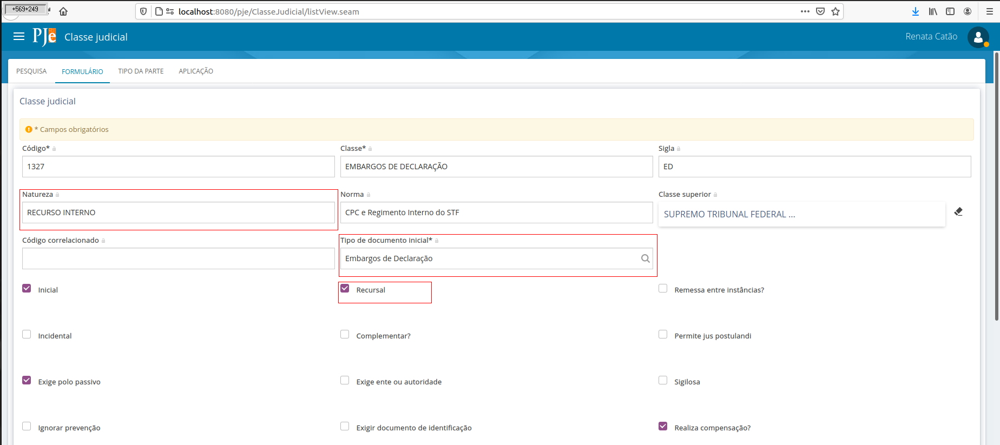

Perceba que as informações importantes para o registro do recurso estão destacadas. Ou seja, a classe tem que ter o como Natureza como "RECURSO INTERNO", deve estar marcada como recursal e deve ter o tipo de documento inicial correspondente vinculado.

## Como é iniciado um recurso interno

Via de regra, o recurso é interposto quando o usuário externo (advogado, procurador, parte) inclui um novo documento expondo seu pleito. O documento, se classificado corretamente pelo usuário na interposição, terá o tipo correspondente à classe recursal interna. Ou seja, se o advogado, por exemplo, quer recorrer por meio de Embargos de Declaração em uma Ação Cautelar, ele deve selecionar, na tela correspondente, o tipo de documento Embargos de Declaração. Veja a tela de inclusão de documentos que o advogado tem acesso:

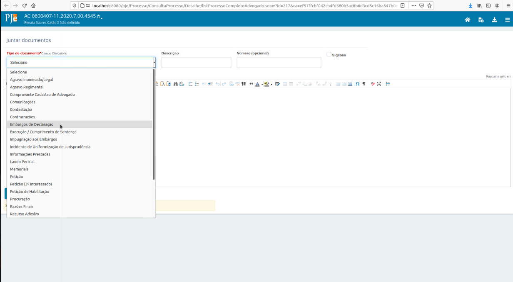

Ele deve selecionar a opção Embargos de Declaração para interpor o recurso correspondente. Ao finalizar a inclusão do documento, é iniciada uma tarefa "Registrar recurso" para que o servidor faça o registro.

Veja que a tarefa ser iniciada é resultado de uma configuração no tipo de documento. Conforme pode-se verificar abaixo, o tipo de documento Embargos de declaração tem um "Fluxo associado". É o fluxo que contém a tarefa registrar recurso. O sistema entende, desse forma, que ao ser inserido um documento desse tipo, será iniciada uma tarefa.

E o que fazer quando o advogado protocola um documento que não iniciou a tarefa de recurso?

Ao analisar os autos do processo, o servidor percebe que o documento de petição inserido pelo advogado é na verdade um recurso interposto. 

### Iniciar tarefa de recurso

O servidor deve, então, iniciar a tarefa de registro de recurso.

Essa possibilidade se dá a partir da tarefa "Analisar determinação"

A tarefa de registro de recurso é criada:

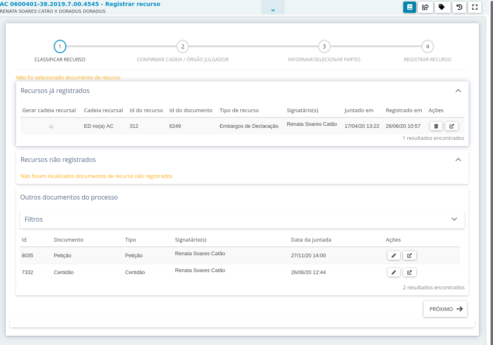

## Registrando um recurso

### Classificar recurso

O primeiro passo no registro do recurso é a classificação. Na classificação, o servidor pode selecionar qual o documento principal do registro e também se o recurso foi interposto para o processo originário ou para um outro recurso, caso já tenham sido registrados recursos para esse processo anteriormente.

A lista de recursos já registrados exibe todos os recursos já registrados pelo servidor. Cada item corresponde a uma capa processual a mais já gerada para o processo originário.

A lista de recursos não registrados exibe todos os documentos vinculados a classes recursais classificadas como "RECURSO INTERNO" e que não estão ainda vinculados a uma capa processual recursal. Em outras palavras, o advogado protocolou um documento de embargos, mas o servidor ainda não registrou o recurso.

Mas o advogado protocolou uma petição contendo um registro de embargos e não é exibida na lista de recursos não registrados. Por quê?

Porque o servidor precisa reclassificar esse documento. A reclassificação acontece na mesma tela. O servidor deve fazer essa reclassificação por meio do ícone de lápis disponível na coluna Ações do documento de petição correspondente:

Ao selecionar salvar, veja que o sistema moverá o documento, que estava na lista "Outros documentos do processo" para a lista "Recursos não registrados":

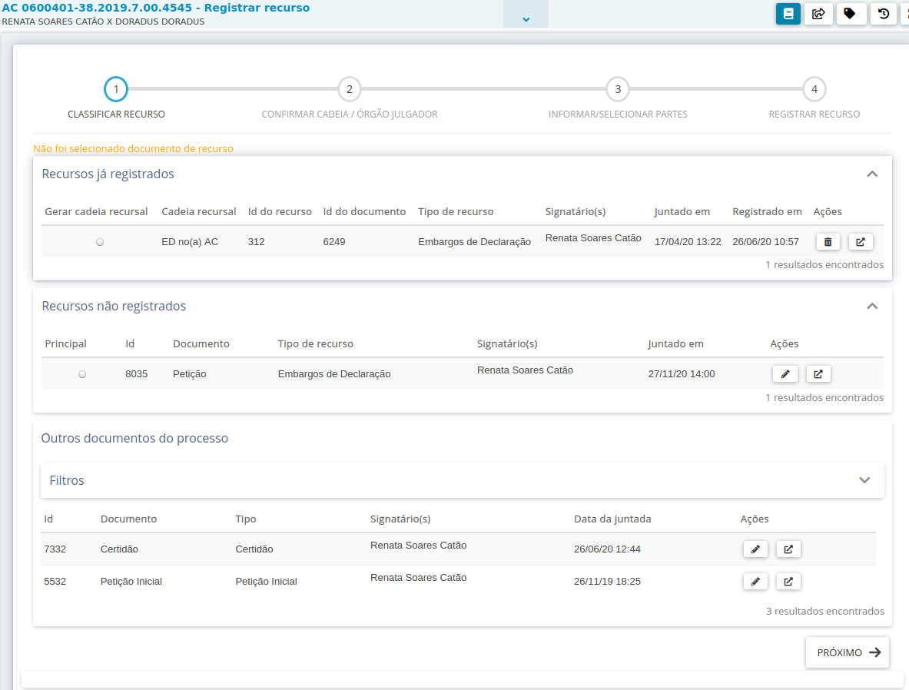

Para o registro do recurso, é obrigatório que um item da lista "Recursos não registrados" esteja selecionado. Se o usuário tentar prosseguir sem a seleção, o sistema não permitirá, notificando que a seleção deve ser realizada:

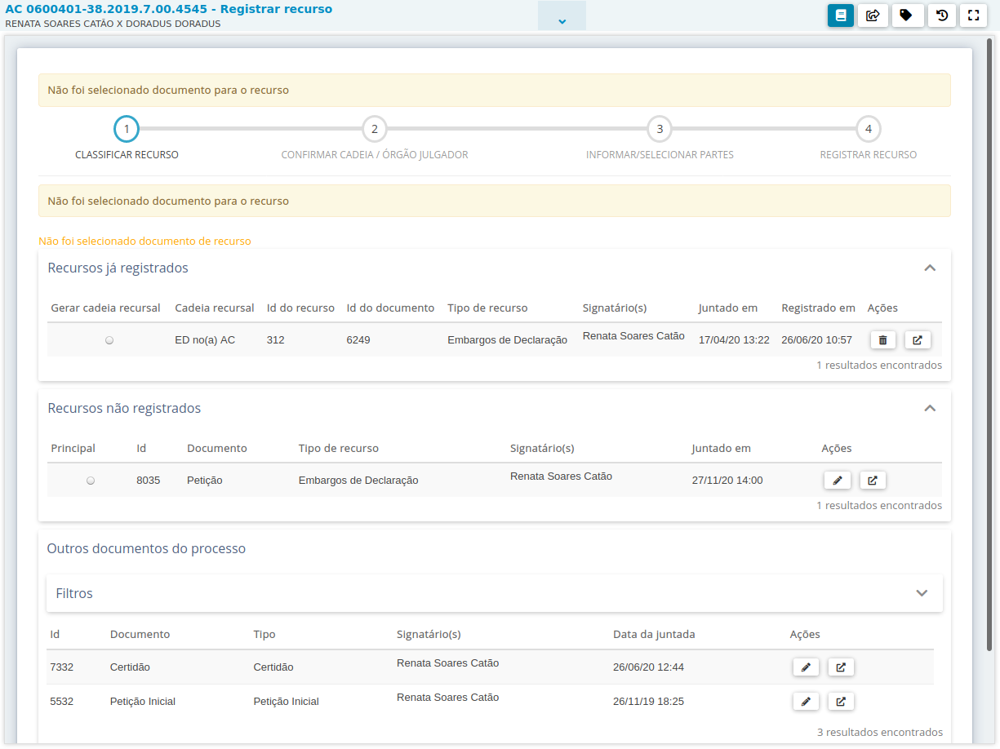

### Confirmar cadeia / órgão julgador

O segundo passo no registro do recurso permite ao usuário confirmar como ficou a "Cadeia recursal" e alterar o órgão julgador de distribuição do recurso.

#### Cadeia recursal

A "Cadeia recursal" identifica, na forma de siglas ou nomes de classe encadeadas no cabeçalho da capa do processo, se o recurso tem como base uma decisão do processo ou uma decisão de outro recurso.

Observe o exemplo abaixo, em que o processo já tinha um recurso registrado. A tela mostra, em "Recursos já registrados", Embargos de Declaração já interpostos para o mesmo número do processo, ou seja, ED no(a) AC. 

Caso seja selecionado o recurso já registrado, o novo recurso será registrado com base no anterior, gerando a seguinte cadeia recursal:

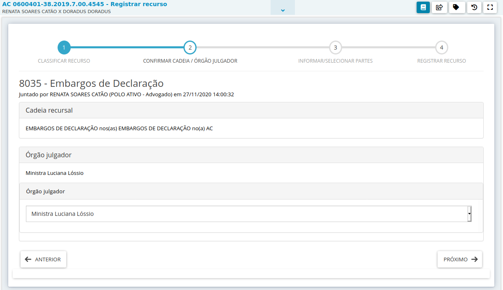

Caso não seja selecionado o recurso já registrado, a cadeia terá apenas a classe do recurso novo e a classe do processo originário.

Por padrão, os cabeçalhos das capas processuais exibirão sempre a cadeia recursal com as siglas da classe, assim como já ocorre com o processo originário.

#### Alterar órgão julgador

Em alguns recursos, o julgamento do recurso terá como relator um órgão julgador diferente do originário do processo. Por exemplo, em Recursos Extraordinários interpostos no TSE, a competência do recurso é da presidência. O sistema permitirá que o usuário selecione um órgão julgador de distribuição do recurso diferente do órgão julgador originário do processo por meio dessa opção.

Se, no entanto, a seleção for equivocada e o usuário precisar ajustar, não há problemas. A possibilidade de se ajustar já no registro do recurso não impede ajustes posteriores, já que o recurso pode ser redistribuído a qualquer tempo, sem que isso resulte na redistribuição do processo originário ou dos outros recursos vinculados.

É válido salientar que a distribuição de recursos não impacta os pesos dos cargos.

### Informar / selecionar partes

O terceiro passo permite ao usuário informar as partes do recurso.

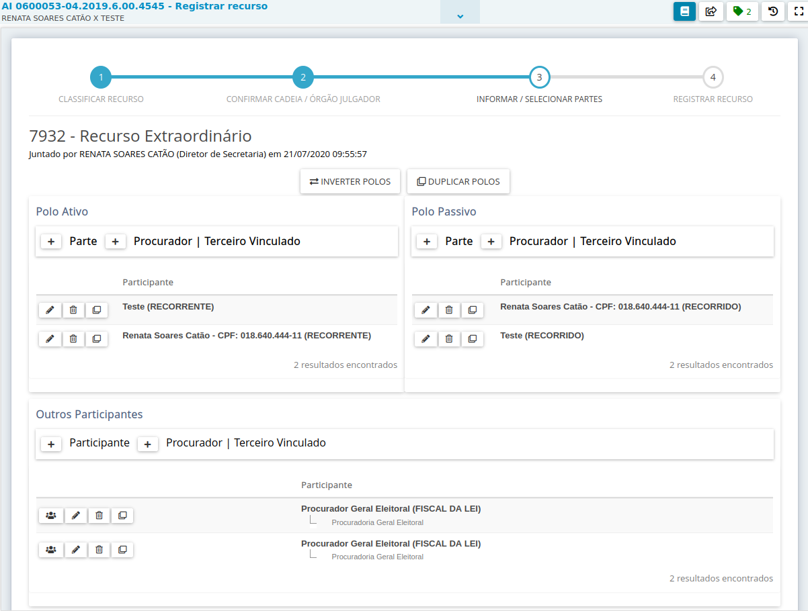

 Observer que os tipos de parte do recurso são os tipos de parte vinculados à classe processual do recurso, como se pode verificar em Configuração - Tabelas Judiciais - Classe Judicial - Classe Judicial . 

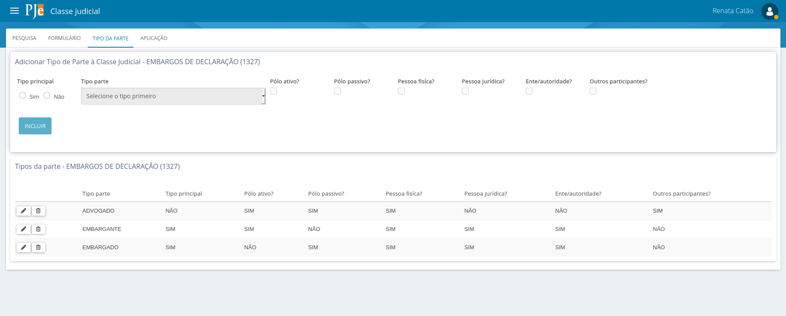

O sistema fará a conversão automática das partes do processo nos tipos de parte principais vinculados à classe do recurso, mas o usuário poderá alterar os tipos, assim como acrescentar ou remover partes e seus representantes.

### Registrar recurso

No quarto e último passo, o usuário pode verificar o resumo das informações do recurso e selecionar a finalização do registro. 

Observe que, a qualquer tempo, a tarefa pode ser finalizada sem que o registro do recurso tenha sido concluído. 

Não há prejuízo algum. Se a finalização da tarefa for selecionada erroneamente, pode-ser iniciar um novo registro, conforme já descrevemos [anteriormente](https://pjeje.github.io/dicas/recursos/#iniciar-tarefa-de-recurso).

Ao selecionar "Cadastrar recurso", o sistema envia o recurso cadastrado para a primeira tarefa do fluxo vinculado à classe recursal, como se pode verificar em Configuração - Tabelas Judiciais - Classe Judicial - Classe Judicial.

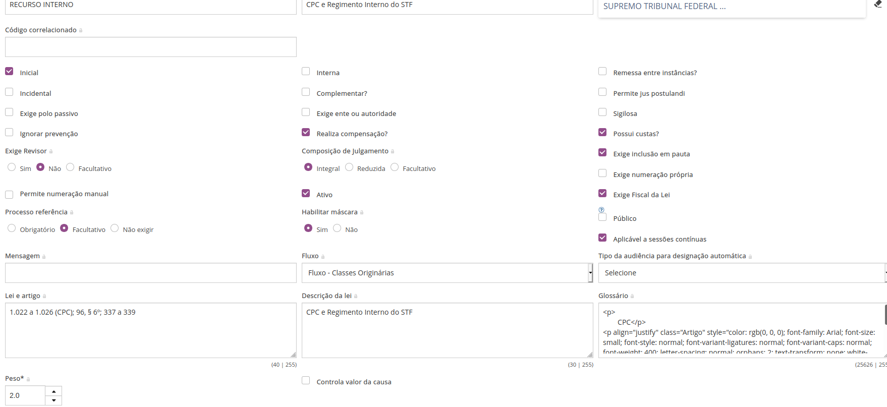

O recurso estará disponível, então, em "Verificar e certificar dados do processo"

## Tramitação dos recursos e do processo originário

Os recursos tramitam internamente de forma independente do processo originário. Isso significa que o processo originário pode estar, por exemplo, em "Analisar determinação", e os embargos estão em "Verificar e certificar dados do processo". 

Veja o exemplo abaixo. Foi utilizado o número do processo para consultar o processo nas tarefas. Como o perfil utilizado tem acesso a todas as tarefas, o sistema exibe o processo nas quatro tarefas abertas para ele.

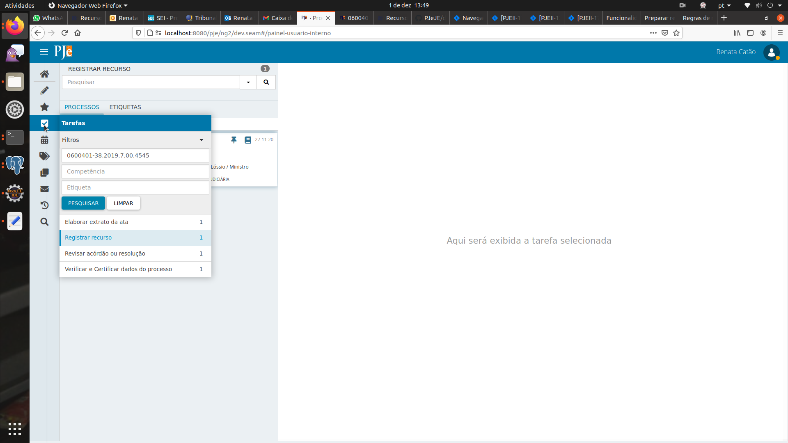

Ao entrar em cada um dos resultados, o usuário verá que o processo principal foi julgado e estão abertas suas tarefas de elaborar extrato da ata e de revisar acórdão, mas já há um recurso registrado (tarefa verificar e certificar dados) e há um novo fluxo de recurso iniciado para o processo principal (tarefa registrar recurso). Observe que a classe processual do cabeçalho na tarefa de acórdão aponta para o processo originário.

Da mesma forma, o cabeçalho do processo na tarefa "Verificar e certificar dados" aponta para o recurso.

Essa tramitação apartada é muito importante para que possam ser feitos os cumprimentos de acordo com a decisão terminativa respectiva. Mesmo com a tramitação apartada, os autos digitais estão com todas as informações do processo. Observe abaixo: o cabeçalho é do recurso, mas a intimação de pauta feita quando o processo originário foi a julgamento está disponível.

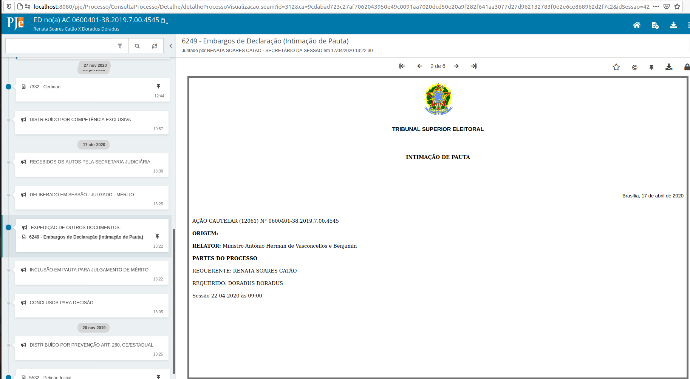

Quando o usuário quiser pautar o recurso em uma sessão de julgamento, a diferenciação também se dará pela classe no cabeçalho do processo. Veja abaixo que estamos pautando o recurso:

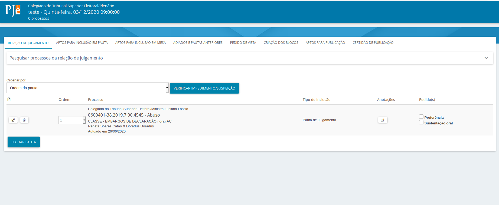

A intimação do recurso também é diferenciada, já que abrange a classe e as partes correspondentes:

## Observações

Ressaltamos alguns comportamentos:

- A consulta pública deve recuperar sempre o processo originário, exibindo as informações de movimento e documentos dos cadernos recursais conforme regras já existentes relacionadas à publicidade das informações.
- A remessa de processos envia todos os cadernos processuais. As consultas do MNI devem retornar apenas um processo por número, contendo todos os movimentos e documentos de todos os cadernos, inclusive os recursais, de acordo com regras pré-existentes nas consultas.
- Algumas alterações em cadernos processuais devem refletir em todos os vinculados, ou seja, se a alteração for no principal ou nos recursais, todos os vinculados ao principal serão afetados. São elas: alteração de características do processo - segredo, nível, visualizadores, prioridades, custas e pedido de liminar/antecipação de tutela, dados eleitorais, assunto e objeto.
- A alteração de classe não reflete em todos os cadernos
- A redistribuição não reflete em todos os cadernos
- A distribuição/redistribuição de recursos não gera novos pesos para o cargo que recebe o caderno
- A inclusão de partes no processo originário e nos cadernos recursais não reflete em alterações fora do caderno sendo alterado, já que as partes podem trocar de polo dependendo do caderno. No entanto, a inclusão de advogados deve sempre refletir em todos os cadernos de forma a manter as representações atualizadas de acordo com a última atualização.

## Orientações para usuários administradores

### Alterações principais no relacionamento entre objetos e tabelas

A estrutura básica de processos judiciais do PJe tem uma entidade Processo e uma entidade ProcessoTrf, às quais são vinculados documentos, partes e movimentos. Antes da implementação dos recursos internos, para cada entidade Processo há uma ProcessoTrf correspondente. com os recursos internos, o relacionamento entre essas entidades é de um ou muitos ProcessoTrf para cada Processo existente. A entidade ProcessoTrf pode estar ou não vinculada a um processo pai, formando uma cadeia recursal. Dessa forma, pode-se ter recursos, que são cadernos processuais distintos, vinculados ao processo originário, assim como recursos vinculados a recursos. 

As querys feitas diretamente no banco de dados, assim como querys hibernates construídas dentro do PJe devem mapear esse novo comportamento. Para facilitar as consultas, foram adicionados campos no banco de dados sem normalização, evitando joins e o processamento mais pesado em determinadas consultas. 

As principais alterações serão relatadas por tabelas alteradas:

- tb_processo

A tabela tem o registro da última capa registrada em tb_processo_trf (cd_processo_status = 'D') relativa a esse processo.

- tb_processo_trf
 
A tabela contém:

o registro do processo originário (id_processo), referenciando a tabela tb_processo (sempre preenchido);
o registro da capa principal do processo (id_processo_trf_principal), referenciando a própria tb_processo_trf (sempre preenchido);
o registro da capa pai (id_processo_trf_pai), que pode existir ou não. Só existirá quando for um recurso do recurso;
a cadeia do recurso em forma de sigla (ds_classe_judicial_sigla). Se o campo não estiver preenchido, a recuperação é pelo campo sigla da classe da capa
a cadeia do recurso por extenso (ds_classe_judicial_extenso). Se o campo não estiver preenchido, a recuperação é pelo campo de descrição da classe da capa
um identificador de recurso interno (in_recurso_interno) 
a identificação da situação do processo (ds_nome_situacao_processual). As situações já existiam antes, mas foi replicada aqui para deixar a consulta mais rápida

- tb_proc_parte_expediente

A tabela tem o identificador da capa principal, para otimizar os joins nas consultas de intimações para usuários externos (id_processo_trf_principal)

As triggers que alimentam tabelas de otimização de consultas (tb_cabecalho_processo e tb_processo_tarefa) foram alteradas para contemplar todas as alterações estruturais das tabelas de origem. As respectivas tabelas, assim como a tabela de documentos e a tabela de movimentos, foram alteradas para conter identifcação da capa a que se refere o registro. 
