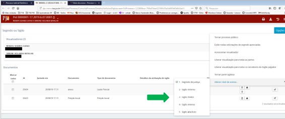
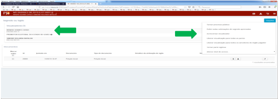
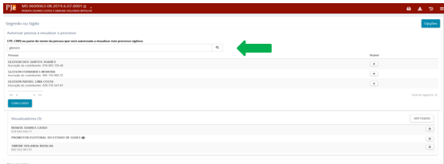

# INSTRUÇÕES SOBRE SIGILO E SEGREDO

Os atos processuais são, em regra, públicos. Todavia, alguns processos correm em segredo de justiça, sendo o acesso aos dados do processo limitado às partes e a seus representantes. Além dos processos, podem também ser tratados como sigilosos documentos do processo. Na propositura da ação, o autor poderá requerer segredo de justiça para os autos processuais ou sigilo para um ou mais documentos ou arquivos do processo, através de indicação em campo próprio. Da mesma forma, em toda e qualquer petição poderá ser requerido sigilo para esta ou para documento ou arquivo a ela vinculado.

Outros processos, por suas próprias características, como classe ou assunto, são tratados como sigilosos, a exemplo da Ação de Impugnação de Mandato Eletivo, nos termos do que prescreve o art. 14, § 11 da Constituição da República.

## SEGREDO OU SIGILO NA JUSTIÇA ELEITORAL

O TSE criou o Grupo de Trabalho PJe Segredo de Justiça, com o objetivo de definir os níveis de segredo de justiça dos processos de tramitação eletrônica para Justiça Eleitoral e definir o nível de segredo das classes e assuntos processuais. Esse grupo se reuniu em três eventos e dessas reuniões saíram as definições que colocamos aqui.

## ZONAS ELEITORAIS

Para as Zonas Eleitorais, em razão do menor número de usuários, foram fixados três níveis de acesso com os respectivos visualizadores:

### NÍVEIS 

**Nível de acesso um:**

a. juiz eleitoral;

b. servidor e servidor processamento;

c. polo ativo e seus representantes;

d. Membros do Ministério Público, como fiscal da lei.

**Nível de acesso três:**

a. juiz eleitoral;  

b. servidor;

c. polo ativo e seus representantes.

**Nível de acesso cinco:**

a. juiz eleitoral;  

b. polo ativo e seus representantes.

### VISUALIZAÇÃO DE PROCESSOS EM SEGREDO DE JUSTIÇA

O sistema, no protocolo inicial do processo, utilizará as regras acima para estabelecer os visualizadores do processo.

É importante ressaltar a diferença entre servidores/magistrados e partes do processo/usuários externos.
Para servidores/magistrados, a visualização é determinada pelo nível do processo. Se o servidor/magistrado não tiver visualização pelo nível do processo, terá ao ser incluído como visualizador.

Para partes do processo/usuários externos, a visualização sempre se dará de acordo com o cadastro na lista de visualizadores.

O servidor somente consegue enxergar nas tarefas os processos cujos níveis de segredo são compatíveis com seu respectivo nível de acesso ou aqueles em que seja cadastrado como visualizador.  Além disso, para fins de abertura dos autos digitais, o usuário precisará ser visualizador do processo ou:

a) ter o mesmo nível do processo ou maior; e

b) ser do mesmo órgão julgador do processo ou, caso não tenha órgão julgador, ser do mesmo órgão julgador colegiado; e

c) se estiver vinculado a um cargo (magistrados são sempre vinculados ao cargo), deve ser o cargo responsável pelo processo ou ter a visibilidade "Todos" no cadastro do órgão julgador.

O ingresso de qualquer parte ou seus representantes posteriormente em um processo sigiloso, não implica liberação automática de visualização dos autos. O cartório terá que liberar manualmente a visualização do processo sigiloso para essas partes, se o juiz autorizar.

Já com ato de comunicação a parte citada/intimada é automaticamente adicionada como visualizadora.

Após uma parte ser adicionada como visualizadora em um processo, a simples alteração do nível de sigilo do processo não fará com que o visualizador não o visualize mais. Se o juiz decide alterar o nível de acesso de 1 para 3, por exemplo, as partes que visualizavam continuarão a visualizar a menos que o servidor retire a visualização.
Cabe salientar também, que colocar uma parte como sigilosa em um processo significa que essa parte não vai ser vista pelas outras partes, mas ela visualiza o processo normalmente

### SEGREDO OU SIGILO DE DOCUMENTO

O sigilo de documento pode ser solicitado no momento de anexar documentos no protocolo do processo, independentemente de o processo ser ou não sigiloso. Na aba “Incluir petições e documentos”, após digitar e salvar a petição inicial ao adicionar os documentos, o advogado pode clicar no botão “Sigiloso”. Dessa forma, apenas o documento escolhido vai ficar em sigilo até que o magistrado da causa decida se assim o mantém. 
O sigilo de documento também pode ser solicitado sempre que um documento for juntado ao processo, através de indicação em campo próprio. Em toda e qualquer petição poderá ser requerido sigilo para esta ou para documento ou arquivo a ela vinculado. Requerido o sigilo de documento ou arquivo, este permanecerá sigiloso até que o magistrado da causa decida em sentido contrário, de ofício ou a requerimento da parte contrária (http://www.pje.jus.br/wiki/index.php/Regras_de_neg%C3%B3cio#RN455).
É possível, ainda, conceder acesso ao documento sigiloso, o que ocorre nos autos digitais, opção “Segredo ou Sigilo” – Documentos – Visualizadores (Sinal de +)

### COMO ATRIBUIR NÍVEIS AOS PROCESSOS

A atribuição dos níveis citados acima é realizada somente pelo administrador do sistema no TSE, previamente à entrada do processo no PJe, no item de menu Cadastro de nível de acesso por competência (Configuração – Competência – sigilo) por meio da competência x classe x assunto (O nível de segredo das classes e assuntos processuais foram decididos em reunião do grupo de trabalho).

Nesse contexto, é possível existir uma classe processual sem nível específico de sigilo com assunto processual que possua segredo, caso em que o processo terá segredo em razão do assunto processual e não da classe. O inverso também é possível. Assim, a definição do nível de segredo leva em conta a combinação de classe com o assunto processual e com a competência.

Não existindo originariamente sigilo para a competência (competência X classe X assunto), atribui-se no sistema nível 1, que será utilizado apenas no caso de o advogado pedir sigilo no momento do peticionamento.

Assim, quando uma classe é considerada pública (prestação de contas, por exemplo), o advogado pode pedir sigilo, indicando durante o peticionamento da inicial, que o processo é sigiloso, marcando na aba “Características”, “Segredo de justiça”, a opção “Sim” e informando o motivo dentre as opções disponíveis. Em seguida, clica novamente no botão “Gravar Sigilo”. O Sistema não poderá recusar a escolha do advogado e atribui nível 1 ao segredo desse processo, até o pedido de sigilo ser apreciado pelo magistrado.
Ainda que a combinação competência X classe X assunto tenha configurada o nível 5 como padrão, o processo protocolado naquela combinação só será sigiloso se o usuário protocolador assim o solicitar. O sistema, então, atribuirá o nível 5 a esse processo.

### ALTERAÇÃO DO NÍVEL DE SEGREDO

Havendo a necessidade de se alterar o nível de segredo do processo, é necessário acessar o processo e os respectivos autos digitais. No menu ao lado direito, selecionar a opção segredo/sigilo, em seguida opções e alterar o nível de acesso. Esta opção estará disponível para o usuário cujo perfil tenha associado a permissão pje:manipulaSigiloso.   

A alteração do nível de acesso será possível independentemente do valor do nível de acesso configurado na competência classe x assunto, e os níveis disponíveis para edição devem estar limitados ao nível do usuário. Caso o processo tenha um nível maior que o do usuário (usuário pode visualizar os níveis porque foi incluído como visualizador), o usuário não poderá alterar o nível do processo.

Vale repetir que a simples alteração do nível de sigilo do processo não fará com que o visualizador não o visualize mais. Se o juiz decide alterar o nível de acesso de 1 para 3, por exemplo, as partes que visualizavam continuarão a visualizar a menos que o servidor retire a visualização.

Somente aos MAGISTRADOS liberou-se nível de acesso 5. Dessa forma, o processo peticionado na competência específica que gere nível 5 de segredo de justiça, entrará na tarefa “Atribuir visualização de processo”.
A tarefa servirá para que o magistrado saiba que um processo de segredo 5 foi peticionado e, se desejar, incluir visualizador.

### COMO O MAGISTRADO ATRIBUI VISUALIZADOR

Na tarefa em que o magistrado indica qual servidor poderá visualizar o processo, ele também pode, a qualquer tempo, atribuir visualização para o polo passivo e/ou outra parte que tenha ingressado posteriormente na relação jurídica processual (terceiros interessados, por exemplo).
Para isso, o magistrado deverá entrar no processo, nos “Autos digitais” => “Segredo ou sigilo” => “Opções” => “Acrescentar visualizador” => “Autorizar pessoa a visualizar processo”. Pesquisa a pessoa com nome ou CPF e clica em concluído. Quadro a quadro abaixo:	  

Regras importantes:

a. a atribuição de visualizador é apenas por processo e a indicação uma por vez;

b. é possível atribuir a visualização a mais de uma pessoa;

c. para retirar a visualização, basta clicar na lixeira;

d. o usuário somente consegue alterar o nível de segredo do processo se os níveis de segredo de justiça do processo e o nível de acesso do usuário forem 
compatíveis,ou seja, nível do usuário maior ou igual ao nível do processo;

e. nas zonas eleitorais, embora sejam apenas 3 níveis, aparecerão, na alteração do nível do processo, os 5 níveis. Os usuários devem utilizar apenas os 
níveis 1, 3 e 5;

f. O usuário que peticiona não escolhe o nível de segredo do processo, isso é configurado pelo administrador do sistema, nos termos descritos linhas acima;  

g. Para que ao processo seja atribuído o nível de segredo que se deseja, é necessário escolher adequadamente a classe e o assunto processual.  

### ATUAÇÃO DE JUIZ SUBSTITUTO EM PROCESSO SIGILOSO NAS ZONAS ELEITORAIS

Na hipótese de atuação de um juiz substituto na zona eleitoral, deve-se levar em consideração algumas peculiaridades do PJE:

Por definição negocial, apenas o magistrado titular tem a marcação de “recebe distribuição? sim”; portanto, todos os processos serão distribuídos ao titular (mesmo se ele se declarar suspeito).

Para que o substituto tenha acesso apenas ao processo no qual deverá atuar, deve-se configurar a visibilidade do juiz substituto só para o cargo dele e adicioná-lo como visualizador do processo (Ele terá acesso ao processo porque é visualizador e terá acesso às tarefas porque é juiz).

Não será possível impedir a visualização do juiz titular, a menos que o processo seja distribuído a outro órgão julgador ao qual o juiz não faça parte.

## SEGREDO OU SIGILO DO PROCESSO NO 2º GRAU

**Atenção:** a configuração dos níveis de sigilo nos TREs e TSE aguarda regulamentação da matéria. 

No segundo e terceiro grau da Justiça Eleitoral o grupo de trabalho decidiu acrescentar um nível de sigilo a mais que no primeiro grau. Esse quarto nível foi atribuído exclusivamente ao Secretário Judiciário, ao Secretário da Corregedoria, aos Assessores-chefes dos Gabinetes e ao Assessor-chefe de Plenário.
No nível cinco de sigilo somente o Ministro Relator terá acesso aos autos e poderá atribuir visualização aos demais ministros. Assim, a partir do momento em que um processo sigiloso chegue na tarefa “Aguarda sessão de julgamento” do Gabinete, o Ministro Relator pode fazer o procedimento de atribuição de visualização dos autos aos demais julgadores.

Para isso, o Ministro deverá entrar no processo, nos “Autos digitais” => “Segredo ou sigilo” => “Opções” => “Acrescentar visualizador” => “Autorizar pessoa a visualizar processo” (ver quadros pág. 6), inserir o CPF de um Ministro e clicar no botão “Concluído”. Esse procedimento deve ser utilizado para cada um dos ministros.

Para os processos sigilosos de nível 1 e 3, o Assessor de Plenário abrirá a visualização dos autos aos demais Ministros. Nesse caso, quando o processo estiver na aba “Aptos para Julgamento”, o Assessor de Plenário já poderá executar o procedimento mencionado no parágrafo anterior.

## NÍVEIS DE SEGREDO DAS CLASSES PROCESSUAIS NO 1º GRAU

Durante a 1ª reunião do Grupo de trabalho, foi fixado o nível de segredo de todas as classes processuais que tramitam na Zona Eleitoral. Para essas classes processuais, o Grupo decidiu manter, no TSE e nos Regionais, os mesmos níveis de segredo atribuídos para a 1ª instância.
	
Nas classes processuais recursais, como recurso especial no TSE e recursos eleitorais nos regionais, o nível de segredo vai depender do nível de segredo do assunto processual. Ao recurso com assunto processual que não tenha segredo, será atribuído nível 1 se o advogado selecionar a opção segredo de justiça. Já se a classe tiver assunto que demande competência especializada em matéria criminal, como no caso de recurso especial com assunto processual da competência especializada, o nível será 5.
	
	

|CLASSE PROCESSUAL / ASSUNTOS                               |SEGREDO|NÍVEL                                                                  |
|-----------------------------------------------------------|-------|-----------------------------------------------------------------------|
|Ação Cautelar                                              |Sim    |Criminal Especializada: 5 Cautelar Cível:3 Cautelar Criminal: 3|
|AIME                                                       |Sim    |3                                                                      |
|AIJE                                                       |Não    |1                                                                      |
|APE                                                        |Não    |Criminal Especializada:5 Demais: 1                                 |
|Boletim De Ocorrência                                      |Não    |Criminal Especializada: 5 Demais: 1                                |
|Apuração De Eleição                                        |Não    |1                                                                      |
|Auto De Prisão                                             |Sim    |Criminal Especializada: 5 Demais: 3                                |
|CIE                                                        |Não    |1                                                                      |
|Cartas Cíveis                                              |Sim    |Cautelares: 3 Demais: 1                                            |
|Cartas Criminais                                           |Sim    |Criminal Especializada: 5 Cautelar Cível:3 Demais: 1           |
|CMR                                                        |Não    |1                                                                      |
|Correição Ordinária E Extraordinária                       |Não    |1                                                                      |
|Cumprimento De Sentença                                    |Não    |1                                                                      |
|Direitos Políticos                                         |Não    |1                                                                      |
|Duplicidade Pluralidade De Inscrições                      |Não    |1                                                                      |
|Embargos À Execução                                        |Não    |1                                                                      |
|Exceção                                                    |Não    |1                                                                      |
|Execução De Pena                                           |Não    |1                                                                      |
|Execução Fiscal                                            |Não    |1                                                                      |
|Filiação Partidária                                        |Não    |1                                                                      |
|Habeas Coropus                                             |Não    |1                                                                      |
|Habeas Data                                                |Não    |1                                                                      |
|ICPJE                                                      |Não    |1                                                                      |
|IPJE                                                       |Não    |1                                                                      |
|Incidente De Avaliação Para Atestar Dependência De Drogas  |Sim    |Criminal Especializada: 5 Demais: 3                                |
|Incidente De Desaforamento                                 |Sim    |Criminal Especializada: 5 Demais: 1                                |
|Incidente De Homoloogação Em Acordo De Colaboração Premiada|Sim    |5                                                                      |
|Incidente De Arguição De Inconstitucionalidade Criminal    |Sim    |Criminal Especializada: 5 Demais: 1                                |
|Incidente De Falsidade                                     |Sim    |Criminal Especializada: 5 Demais: 1                                |
|Incidente De Insanidade Mental Do Acusado                  |Sim    |Criminal Especializada: 5 Demais: 3                                |
|Incidente De Uniformização De Interpretação De Lei Criminal|Não    |1                                                                      |
|Incidente De Reabilitação                                  |Sim    |Criminal Especializada: 5 Demais: 1                                |
|Inquérito Policial                                         |Sim    |Criminal Especializada: 5 Cautelares Criminais: 5 Demais: 1    |
|Inspeção                                                   |Sim    |5                                                                      |
|LAPP                                                       |Não    |1                                                                      |
|MI                                                         |Não    |1                                                                      |
|MSC                                                        |Não    |1                                                                      |
|Cautelares Criminais                                       |Sim    |5                                                                      |
|NIP                                                        |Não    |1                                                                      |
|Pet-Adm                                                    |Não    |1                                                                      |
|Petição Cível                                              |Não    |1                                                                      |

## FIXAÇÃO DO NÍVEL DE SIGILO PARA AS NOVAS CLASSES HABILITADAS NO PJE

A tabela abaixo mostra o nível de sigilo que a Comissão de Acompanhamento e Atualização das Tabelas Processuais 
Unificadas, TPU, da Justiça Eleitoral fixou para cada uma das novas classes habilitadas no PJE. Na mesma linha 
do que já havia sido decidido no GT do Sigilo em reuniões anteriores, acordou-se em atribuir o nível 5 de sigilo
aos assuntos que demandem competência especializada em matéria criminal.

|CLASSE                                                     |CÓD.|NÍVEL DE SIGILO                                                        |ASSUNTOS COMP. ESPECIALIZADA    |NÍVEL DE SIGILO|
|-----------------------------------------------------------|----|-----------------------------------------------------------------------|--------------------------------|---------------|
|Agravo em Recurso Especial Eleitoral                       |12626|1                                                                      |                                |               |
|Alienação de Bens do Acusado (AlienBAc)                    |1717|1                                                                      |Pasta Direito Penal – cód. 287  |5              |
|Arresto/Hipoteca Legal (ArrHipLeg)                         |330 |1                                                                      |Pasta Direito Penal – cód. 287  |5              |
|Cautelar Fiscal (CauFis)                                   |83  |1                                                                      |                                |               |
|Conflito de Competência Cível (CCCiv)                      |221 |1                                                                      |                                |               |
|Conflito de Jurisdição (ConfJurisd)                        |325 |1                                                                      |Pasta Direito Penal – cód. 287  |5              |
|Embargos à Execução Fiscal (EEfis)                         |1118|1                                                                      |                                |               |
|Embargos de Terceiro Cível (Etciv)                         |37  |1                                                                      |                                |               |
|Embargos do Acusado (EmbAc)                                |1715|1                                                                      |Pasta Direito Penal – cód. 287 5|5              |
|Exceção da Verdade (Verdade)                               |324 |1                                                                      |                                |               |
|Execução de Medidas Alternativas (ExMedAlt)                |12729|1                                                                      |                                |               |
|Exibição de Documento ou Coisa Cível (ExDoCoCiv)           |228 |1                                                                      |                                |               |
|Exibição De Documento ou Coisa Criminal (ExDoCoCrim)       |11788|1                                                                      |Pasta Direito Penal – cód. 287  |5              |
|Liberdade Provisória Com ou Sem Fiança (LibProv)           |305 |1                                                                      |Pasta Direito Penal – cód. 287  |5              |
|Mandado de Segurança Criminal (MSCrim)                     |1710|1                                                                      |Pasta Direito Penal – cód. 287  |5              |
|Pedido de Novas Eleições (PNE)                             |12629|1                                                                      |                                |               |
|Petição Criminal (PETCRIM)                                 |1727|1                                                                      |Pasta Direito Penal – cód. 287  |5              |
|Procedimento Investigatório Criminal (PICMP)               |1733|1                                                                      |Pasta Direito Penal – cód. 287  |5              |
|Produção Antecipada da Prova (PAP)                         |193 |3                                                                      |                                |               |
|Relaxamento de Prisão (RelPri)                             |306 |                                                                       |Pasta Direito Penal – cód. 287  |5              |
|Restituição de Coisas Apreendidas (ReCoAp)                 |326 |                                                                       |Pasta Direito Penal – cód. 287  |5              |
|Sequestro (Seques)                                         |329 |5                                                                      |                                |               |

Fontes:

1 Roteiro de utilização de sigilo e segredo de justiça - http://www.pje.jus.br/wiki/index.php/Roteiro_de_utiliza%C3%A7%C3%A3o_de_sigilo_e_segredo_de_justi%C3%A7a.
    
2 Ata da 1ª reunião do Grupo de Trabalho PJE Segredo de Justiça. 
    
3 Ata da 2ª reunião do Grupo de Trabalho PJE Segredo de Justiça.
    
4 Ata da 1ª reunião da Comissão de Acompanhamento e Atualização das Tabelas Processuais Unificadas (TPU) da Justiça Eleitoral.
    
5 Orientações sobre a funcionalidade de sigilo – Arquivo ASPJE.
